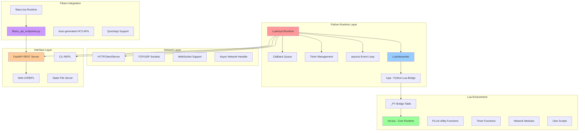
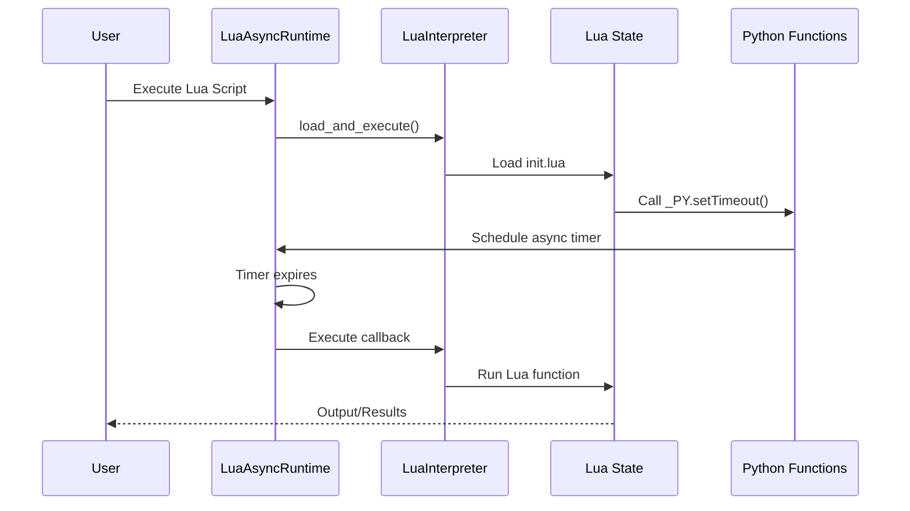
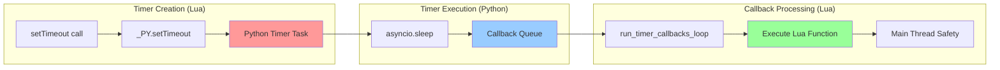
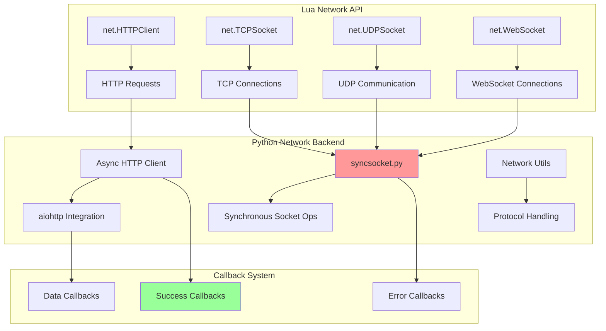
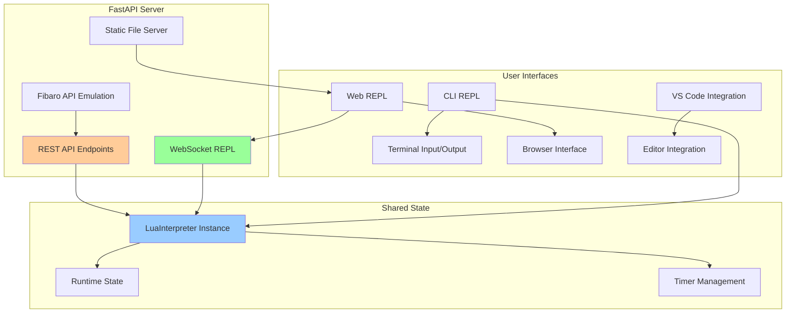
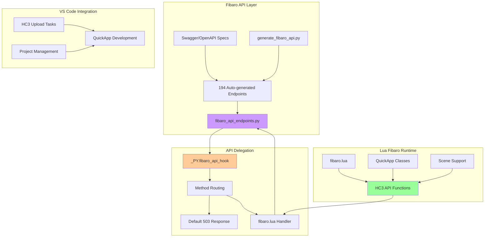
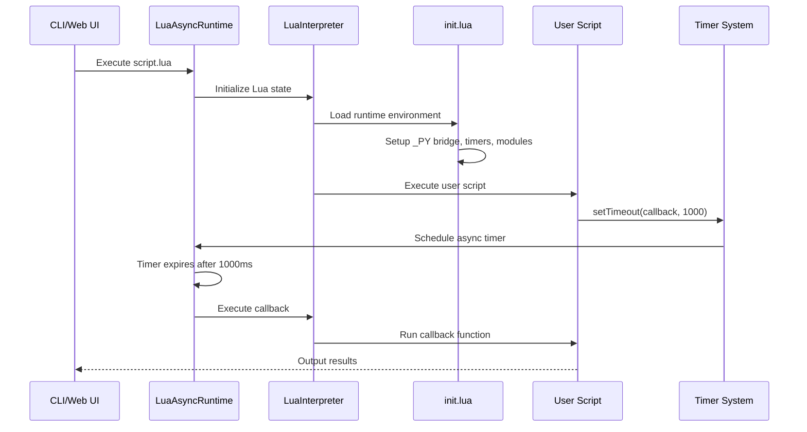
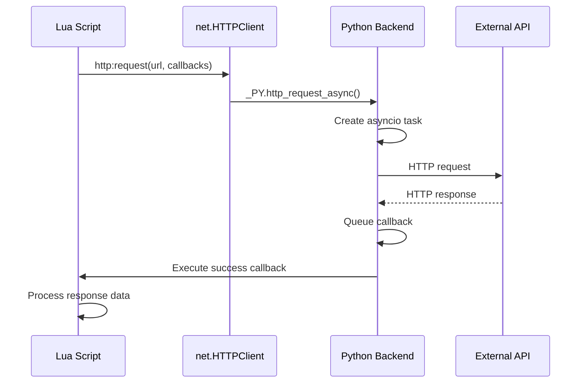
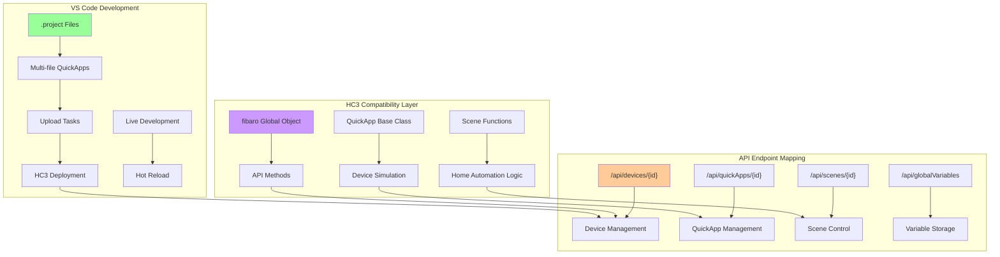
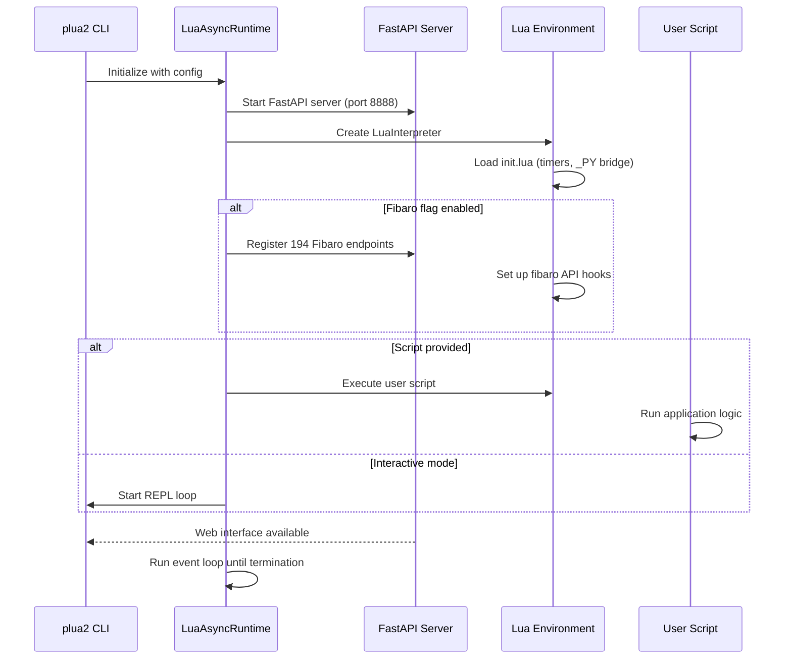

# plua2 Architecture

plua2 is a Python-Lua async runtime that bridges Python's asyncio with Lua's coroutines, providing JavaScript-like timers and async operations. This document outlines the core architecture, components, and subsystems.

## 📋 Table of Contents

- [Overview](#overview)
- [Core Architecture](#core-architecture)
- [Component Details](#component-details)
- [Data Flow](#data-flow)
- [Fibaro Integration](#fibaro-integration)
- [Development Patterns](#development-patterns)

## 🏗️ Overview

plua2 can be thought of as "Node.js for Lua" with Python as the runtime. It provides:

- **Async Lua Runtime**: Coroutine-based async operations
- **JavaScript-style Timers**: `setTimeout`, `clearTimeout`, `setInterval`
- **Network Layer**: HTTP, TCP, UDP, WebSocket support
- **Web Interface**: Browser-based REPL and development tools
- **REST API**: HTTP endpoints for external integration
- **Fibaro HC3 Emulation**: Complete HC3 API compatibility

## 🔧 Core Architecture



## 🧩 Component Details

### 1. Python Runtime Core

#### LuaAsyncRuntime (`src/plua2/runtime.py`)
- **Role**: Main async event loop coordinator
- **Responsibilities**:
  - Manages asyncio event loop
  - Coordinates timer execution
  - Handles async callback processing
  - Provides runtime state management

#### LuaInterpreter (`src/plua2/interpreter.py`)
- **Role**: Lua runtime wrapper with Python bridge
- **Responsibilities**:
  - Wraps lupa Lua state
  - Manages `_PY` bridge table
  - Handles Lua code execution
  - Provides error handling and debugging



### 2. The _PY Bridge System

The `_PY` table is the central communication mechanism between Python and Lua:

```lua
-- Core bridge functions
_PY.setTimeout(callback, delay_ms)    -- Timer creation
_PY.clearTimeout(timer_id)           -- Timer cancellation
_PY.json_encode(data)                -- JSON serialization
_PY.json_decode(string)              -- JSON parsing
_PY.getRuntimeState()                -- Runtime introspection

-- Hook system for customization
_PY.main_file_hook = function(filename) end      -- File preprocessing
_PY.fibaro_api_hook = function(method, path, data) end  -- API delegation
_PY.isRunning = function() return true end       -- Auto-termination
```

#### Function Export Pattern
Python functions are exported using the `@lua_exporter` decorator:

```python
@lua_exporter
def my_function(arg1, arg2):
    """Function exposed to Lua as _PY.my_function"""
    return result
```

### 3. Async Timer Architecture

plua2 implements a producer-consumer pattern for timer management:



**Key Design Principles:**
1. **Thread Safety**: All Lua execution happens in the main thread
2. **Async Coordination**: Python asyncio manages timer scheduling
3. **Callback Queue**: Decouples timer expiration from Lua execution
4. **Resource Management**: Automatic cleanup of expired timers

### 4. Network Layer

The network subsystem provides async networking with Fibaro HC3 compatibility:



### 5. Web Interface and REST API

plua2 provides multiple interfaces for interaction:



#### API Server Structure (`api_server.py`)
- **FastAPI Application**: Modern async web framework
- **Static File Serving**: Web UI assets from `/static/` directory
- **WebSocket REPL**: Real-time Lua interaction
- **Shared Interpreter**: Same Lua state across CLI and web interfaces

### 6. Fibaro HC3 Integration

The `--fibaro` flag enables comprehensive Fibaro Home Center 3 emulation:



#### Fibaro Integration Flow

1. **Endpoint Generation**: `generate_fibaro_api.py` processes Swagger specs
2. **API Registration**: 194 endpoints automatically registered with FastAPI
3. **Hook System**: `_PY.fibaro_api_hook` handles all API calls
4. **Default Behavior**: Returns 503 "Service Unavailable" unless overridden
5. **fibaro.lua Override**: Provides actual HC3 functionality when loaded

## 🔄 Data Flow

### Script Execution Flow



### Network Request Flow



## 🏠 Fibaro Integration Architecture

### HC3 API Emulation



### QuickApp Development Workflow

1. **Development**: Write QuickApp in VS Code with plua2
2. **Testing**: Use `--fibaro` flag for HC3 API emulation
3. **Upload**: VS Code tasks upload to real HC3 system
4. **Debugging**: plua2 provides debugging capabilities

## 🛠️ Development Patterns

### Module Registration Pattern
```python
from plua2.luafuns_lib import lua_exporter

@lua_exporter
def my_utility_function(param1, param2):
    """Exposed to Lua as _PY.my_utility_function"""
    # Implementation
    return result
```

### Hook Override Pattern
```lua
-- Custom file preprocessing
function _PY.main_file_hook(filename)
    print("Loading:", filename)
    -- Custom logic here
    -- Call original implementation or custom loading
end

-- Custom API handling
function _PY.fibaro_api_hook(method, path, data)
    if path:match("^/api/devices") then
        -- Handle device API calls
        return custom_device_handler(method, path, data)
    end
    -- Return nil, 503 for unhandled paths
    return nil, 503
end
```

### Error Handling Pattern
```lua
-- Async operations with error handling
local client = net.HTTPClient()
client:request("https://api.example.com/data", {
    success = function(response)
        print("Success:", response.data)
    end,
    error = function(err)
        print("Error:", err)
        -- Fallback logic
    end
})
```

## 🚀 Startup Sequence



## 📊 Performance Considerations

### Timer Performance
- **Callback Queue**: Prevents blocking the main thread
- **Batch Processing**: Multiple callbacks processed per loop iteration
- **Resource Cleanup**: Automatic cleanup of expired timers

### Memory Management
- **Lua GC**: Standard Lua garbage collection
- **Python References**: Careful management of Python-Lua object references
- **Callback Cleanup**: Non-persistent callbacks automatically removed

### Network Performance
- **Async I/O**: Non-blocking network operations
- **Connection Pooling**: Reuse of HTTP connections where possible
- **Error Recovery**: Graceful handling of network failures

## 🔧 Configuration and Extensibility

### Runtime Configuration
```python
# Example configuration options
config = {
    "api_port": 8888,
    "debug": False,
    "fibaro_enabled": True,
    "auto_termination": False,
    "duration": None  # Auto-termination time
}
```

### Extension Points
1. **Custom _PY Functions**: Add new Python functions via `@lua_exporter`
2. **Hook Overrides**: Customize file loading and API handling
3. **Module System**: Add new Lua modules via `require()`
4. **API Endpoints**: Extend FastAPI server with custom endpoints

This architecture provides a robust, extensible foundation for async Lua development with comprehensive HC3 compatibility and modern web-based development tools.
