# plua Architecture

plua is a Python-Lua async runtime that bridges Python's asyncio with Lua's coroutines, providing JavaScript-like timers and async operations. This document outlines the core architecture, components, and subsystems.

**Current Version**: 1.1.4

## 📋 Table of Contents

- [Overview](#overview)
- [Core Architecture](#core-architecture)
- [Component Details](#component-details)
- [Signal Handling & Process Management](#signal-handling--process-management)
- [Configuration System](#configuration-system)
- [Data Flow](#data-flow)
- [Fibaro Integration](#fibaro-integration)
- [Development Patterns](#development-patterns)
- [Packaging and Distribution](#packaging-and-distribution)
- [Troubleshooting](#troubleshooting)

## 🏗️ Overview

plua can be thought of as "Node.js for Lua" with Python as the runtime. It provides:

- **Async Lua Runtime**: Coroutine-based async operations
- **JavaScript-style Timers**: `setTimeout`, `clearTimeout`, `setInterval`
- **Network Layer**: HTTP, TCP, UDP, WebSocket support
- **Web Interface**: Browser-based REPL and development tools
- **REST API**: HTTP endpoints for external integration
- **Fibaro HC3 Emulation**: Complete HC3 API compatibility

## 🔧 Core Architecture

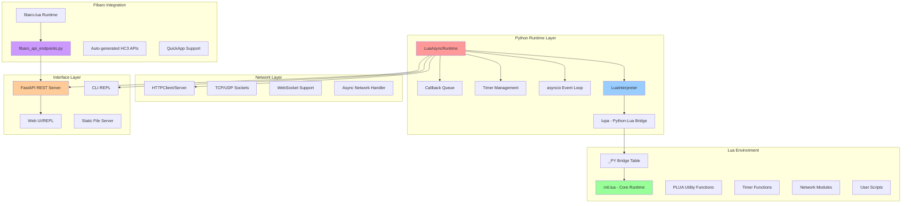

## 🧩 Component Details

### 1. Python Runtime Core

#### LuaAsyncRuntime (`src/plua/runtime.py`)
- **Role**: Main async event loop coordinator
- **Responsibilities**:
  - Manages asyncio event loop
  - Coordinates timer execution
  - Handles async callback processing
  - Provides runtime state management

#### LuaInterpreter (`src/plua/interpreter.py`)
- **Role**: Lua runtime wrapper with Python bridge
- **Responsibilities**:
  - Wraps lupa Lua state
  - Manages `_PY` bridge table
  - Handles Lua code execution
  - Provides error handling and debugging

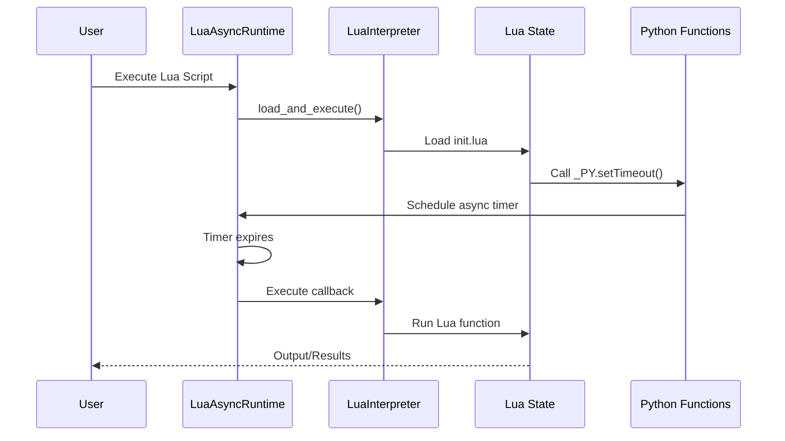

### 2. The _PY Bridge System

The `_PY` table is the central communication mechanism between Python and Lua:

```lua
-- Core bridge functions
_PY.setTimeout(callback, delay_ms)    -- Timer creation
_PY.clearTimeout(timer_id)           -- Timer cancellation
_PY.json_encode(data)                -- JSON serialization
_PY.json_decode(string)              -- JSON parsing
_PY.getRuntimeState()                -- Runtime introspection

-- Hook system for customization
_PY.main_file_hook = function(filename) end      -- File preprocessing
_PY.fibaro_api_hook = function(method, path, data) end  -- API delegation
_PY.isRunning = function() return true end       -- Auto-termination
```

#### Function Export Pattern
Python functions are exported using the `@lua_exporter` decorator:

```python
@lua_exporter
def my_function(arg1, arg2):
    """Function exposed to Lua as _PY.my_function"""
    return result
```

### 3. Async Timer Architecture

plua implements a producer-consumer pattern for timer management:

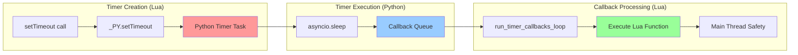

**Key Design Principles:**
1. **Thread Safety**: All Lua execution happens in the main thread
2. **Async Coordination**: Python asyncio manages timer scheduling
3. **Callback Queue**: Decouples timer expiration from Lua execution
4. **Resource Management**: Automatic cleanup of expired timers

## 🛡️ Signal Handling & Process Management

plua implements robust signal handling and process cleanup for reliable operation across platforms:

### Unified Signal Handler

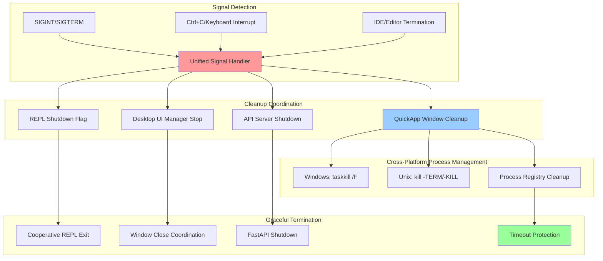

### Desktop UI Management (`desktop_ui.py`)

The desktop UI system manages QuickApp windows with full lifecycle control:

#### Key Features:
- **Window Registry**: Persistent tracking of QuickApp windows across sessions
- **Process Management**: Cross-platform process termination and cleanup
- **Force Cleanup**: Handles orphaned processes from IDE kills (kill -9)
- **Graceful Shutdown**: Coordinates with signal handler for clean exits

#### Window Lifecycle:
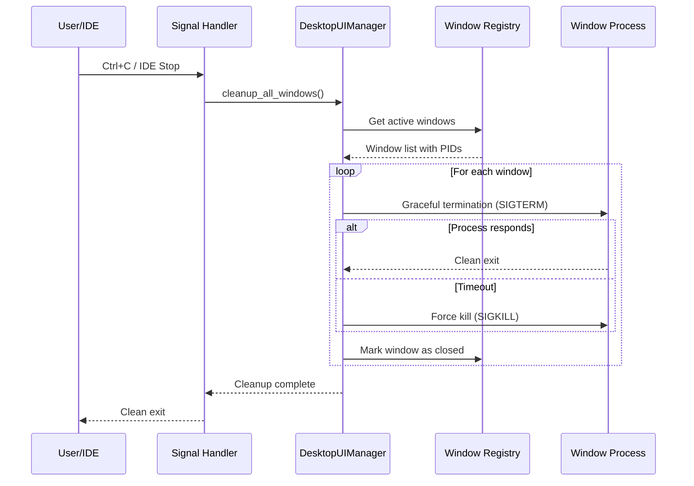

### Timeout Protection

All cleanup operations include timeout protection to prevent hanging:

```python
# Example timeout protection pattern
try:
    # Graceful termination attempt
    process.terminate()
    process.wait(timeout=3)  # 3-second grace period
except TimeoutExpired:
    # Force termination if graceful fails
    process.kill()
    process.wait(timeout=2)  # Additional timeout for force kill
```

## ⚙️ Configuration System

plua provides multiple configuration mechanisms for different use cases:

### CLI Configuration

```bash
# Basic execution modes
plua script.lua                    # Standard execution
plua --noapi script.lua           # Disable API server
plua --duration 60 script.lua     # Auto-terminate after 60 seconds

# Development flags
plua --local script.lua           # Enable local development mode
plua --fibaro script.lua          # Enable Fibaro HC3 emulation
plua --debugger script.lua        # Enable MobDebug remote debugging

# Signal handling and cleanup
plua --close-windows              # Close all QuickApp windows and exit
plua --cleanup-registry           # Clean up window registry and exit
plua --cleanup-port              # Clean up stuck API port and exit
```

### Runtime Configuration Bridge

The `--local` flag demonstrates the configuration bridge pattern:

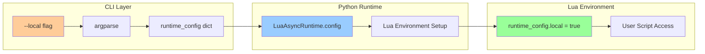

#### Implementation Pattern:
```python
# Python side (main.py)
def setup_runtime_config(args):
    config = {}
    if args.local:
        config['local'] = True
    return config

# Lua side (accessible in scripts)
if runtime_config.local then
    print("Running in local development mode")
    -- Enable local-specific features
end
```

### Environment Configuration

plua supports `.env` file configuration for external integrations:

```env
# HC3 Integration
HC3_URL=https://192.168.1.100
HC3_USER=admin
HC3_PASSWORD=your_password

# Development Settings
DEBUG=true
LOG_LEVEL=info
API_PORT=8888
```

### 4. Network Layer

The network subsystem provides async networking with Fibaro HC3 compatibility:

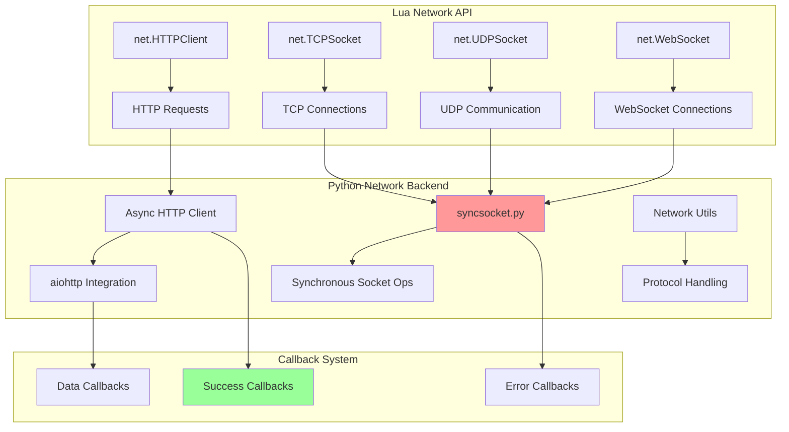

### 5. User Experience & Output Management

plua prioritizes clean, professional output with comprehensive debug message management:

#### Output Philosophy:
- **Silent Operation**: Background processes (window creation, cleanup) operate silently
- **Essential Warnings Only**: Error conditions that need user attention are preserved
- **Development vs Production**: Debug output available when explicitly enabled
- **Clean Termination**: Signal handling produces minimal, informative output

#### Debug Output Cleanup:
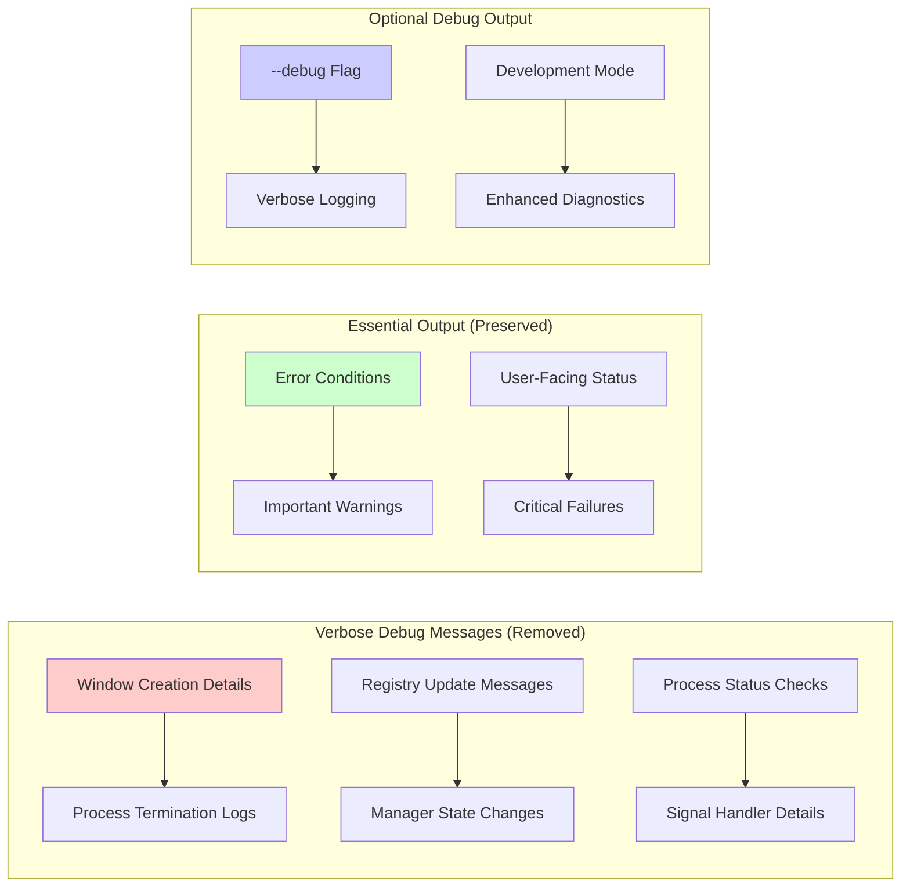

#### Clean Output Examples:
```bash
# Before cleanup (verbose)
get_desktop_manager called, desktop_manager = None
Creating new DesktopUIManager instance
Checking for existing window for QA 4123
Terminated process for window qa_4123_1234567 (PID: 1234)
Desktop UI Manager stopped - closed all windows

# After cleanup (clean)
Plua v1.1.4 with Lua 5.4
API server on 0.0.0.0:8888
[DEBUG][Basic_Proxy4123]: Basic_Proxy initialized
```

### 6. Web Interface and REST API

plua provides multiple interfaces for interaction:

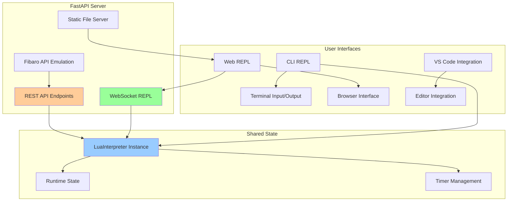

#### API Server Structure (`api_server.py`)
- **FastAPI Application**: Modern async web framework
- **Static File Serving**: Web UI assets from `/static/` directory
- **WebSocket REPL**: Real-time Lua interaction
- **Shared Interpreter**: Same Lua state across CLI and web interfaces

### 6. Fibaro HC3 Integration

The `--fibaro` flag enables comprehensive Fibaro Home Center 3 emulation:

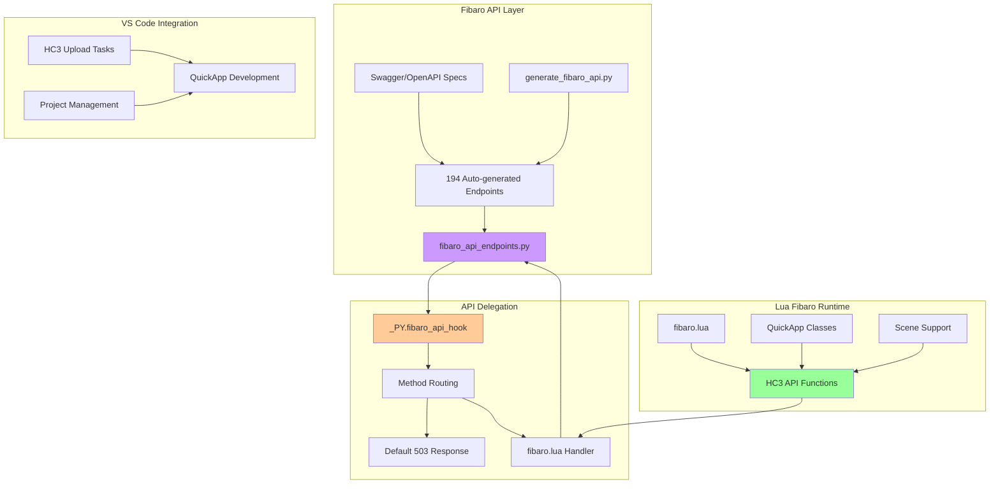

#### Fibaro Integration Flow

1. **Endpoint Generation**: `generate_fibaro_api.py` processes Swagger specs
2. **API Registration**: 194 endpoints automatically registered with FastAPI
3. **Hook System**: `_PY.fibaro_api_hook` handles all API calls
4. **Default Behavior**: Returns 503 "Service Unavailable" unless overridden
5. **fibaro.lua Override**: Provides actual HC3 functionality when loaded

## 🔄 Data Flow

### Script Execution Flow

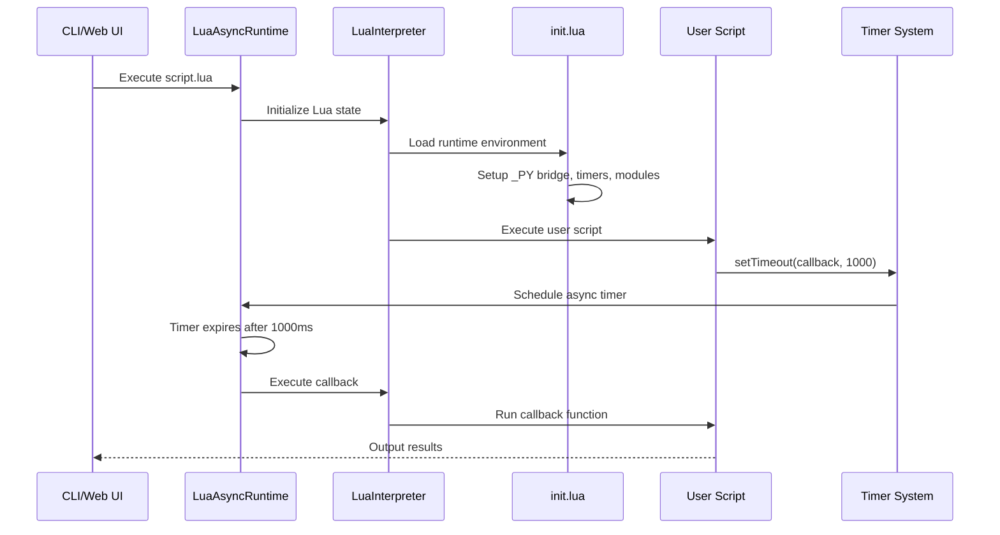

### Network Request Flow

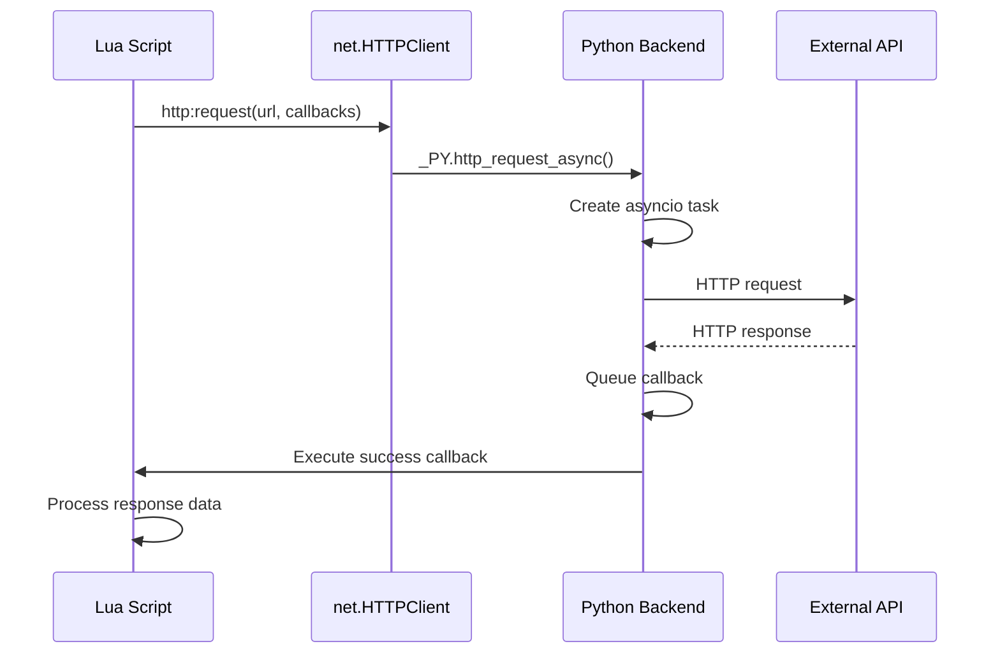

## 🏠 Fibaro Integration Architecture

### HC3 API Emulation

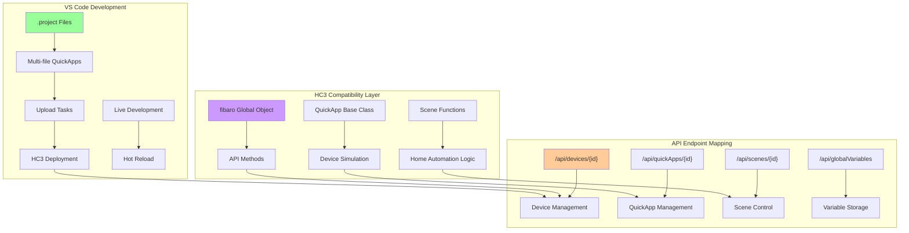

### QuickApp Development Workflow

1. **Development**: Write QuickApp in VS Code with plua
2. **Testing**: Use `--fibaro` flag for HC3 API emulation
3. **Upload**: VS Code tasks upload to real HC3 system
4. **Debugging**: plua provides debugging capabilities

## 🛠️ Development Patterns

### Module Registration Pattern
```python
from plua.luafuns_lib import lua_exporter

@lua_exporter
def my_utility_function(param1, param2):
    """Exposed to Lua as _PY.my_utility_function"""
    # Implementation
    return result
```

### Hook Override Pattern
```lua
-- Custom file preprocessing
function _PY.main_file_hook(filename)
    print("Loading:", filename)
    -- Custom logic here
    -- Call original implementation or custom loading
end

-- Custom API handling
function _PY.fibaro_api_hook(method, path, data)
    if path:match("^/api/devices") then
        -- Handle device API calls
        return custom_device_handler(method, path, data)
    end
    -- Return nil, 503 for unhandled paths
    return nil, 503
end
```

### Error Handling Pattern
```lua
-- Async operations with error handling
local client = net.HTTPClient()
client:request("https://api.example.com/data", {
    success = function(response)
        print("Success:", response.data)
    end,
    error = function(err)
        print("Error:", err)
        -- Fallback logic
    end
})
```

## 🚀 Startup Sequence

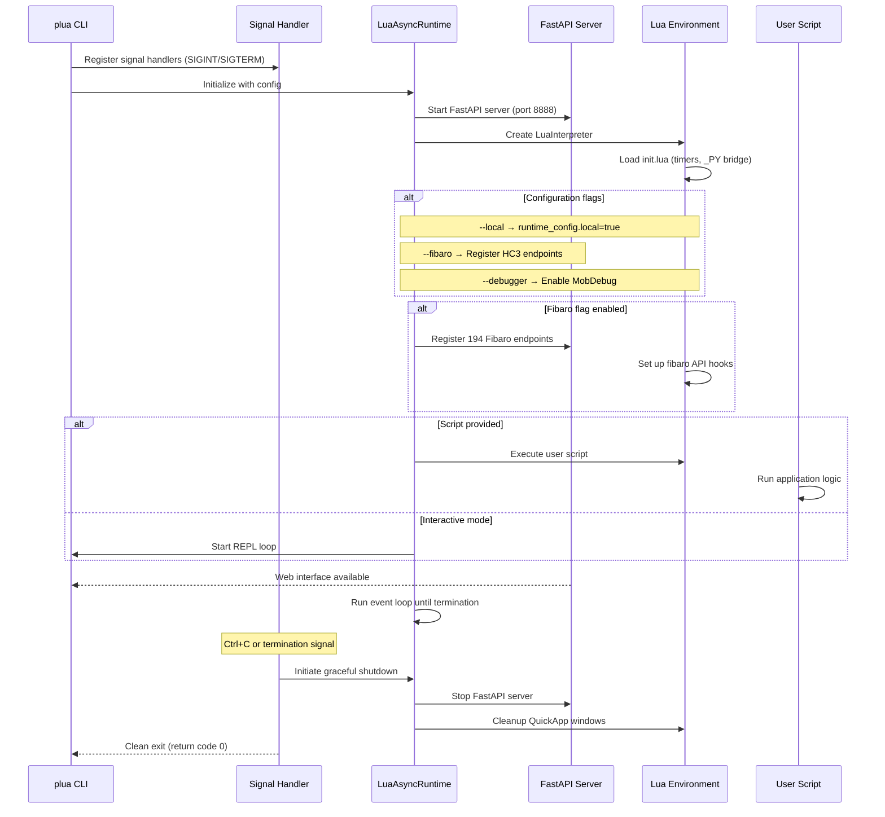

## 🔧 Enhanced CLI Interface

### Command Structure

plua's CLI follows Unix conventions with comprehensive flag support:

```bash
# Execution Modes
plua                              # Interactive REPL
plua script.lua                   # Execute script
plua -e 'code' script.lua         # Inline code + script
plua -i script.lua                # Execute then enter REPL

# Configuration Flags
plua --local script.lua           # Enable local development mode
plua --fibaro script.lua          # Enable HC3 emulation
plua --duration 60 script.lua     # Auto-terminate after 60 seconds
plua --debugger script.lua        # Enable remote debugging

# API Server Control
plua --noapi script.lua           # Disable API server
plua --api-port 9000 script.lua   # Custom API port
plua --api-host 127.0.0.1 script.lua  # Custom API host

# Utility Commands
plua --cleanup-port               # Clean up stuck API port
plua --close-windows              # Close all QuickApp windows
plua --close-qa-window 123        # Close specific QA window
plua --cleanup-registry           # Clean up window registry
plua --version                    # Show version information
```

### Enhanced Help System

```bash
$ plua --help
usage: plua [-h] [-e SCRIPT_FRAGMENTS] [--duration DURATION] 
            [--debugger] [--debug] [--fibaro] [--local] [-i]
            [--noapi] [--api-port API_PORT] [--cleanup-port]
            [--close-windows] [--version] [lua_file]

plua - Python-Lua async runtime with timer support

positional arguments:
  lua_file              Lua file to execute

options:
  --local               Enable local mode (sets runtime_config.local=true)
  --fibaro              Load Fibaro API support  
  --cleanup-port        Clean up the API port and exit
  --close-windows       Close all open QuickApp windows and exit
  
Examples:
  plua --local script.lua           # Local development mode
  plua --fibaro --local script.lua  # HC3 emulation + local mode
  plua --cleanup-port               # Fix stuck API port
```

## 📊 Performance Considerations

### Timer Performance
- **Callback Queue**: Prevents blocking the main thread
- **Batch Processing**: Multiple callbacks processed per loop iteration
- **Resource Cleanup**: Automatic cleanup of expired timers

### Memory Management
- **Lua GC**: Standard Lua garbage collection
- **Python References**: Careful management of Python-Lua object references
- **Callback Cleanup**: Non-persistent callbacks automatically removed

### Network Performance
- **Async I/O**: Non-blocking network operations
- **Connection Pooling**: Reuse of HTTP connections where possible
- **Error Recovery**: Graceful handling of network failures

## 🔧 Configuration and Extensibility

### Runtime Configuration
```python
# Example configuration options
config = {
    "api_port": 8888,
    "debug": False,
    "fibaro_enabled": True,
    "auto_termination": False,
    "duration": None  # Auto-termination time
}
```

### Extension Points
1. **Custom _PY Functions**: Add new Python functions via `@lua_exporter`
2. **Hook Overrides**: Customize file loading and API handling
3. **Module System**: Add new Lua modules via `require()`
4. **API Endpoints**: Extend FastAPI server with custom endpoints

## 📦 Packaging and Distribution

### PyPI Publishing Pipeline

plua uses GitHub Actions for automated publishing to PyPI:

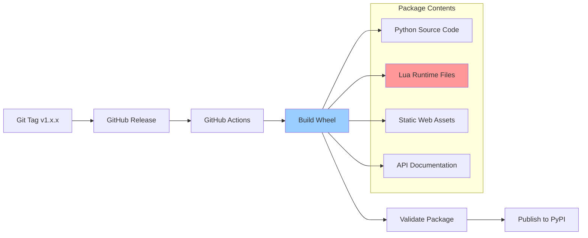

#### Critical Packaging Requirements

1. **Lua Files Inclusion**: The `src/lua/` directory contains essential runtime files:
   - `init.lua` - Core runtime bootstrap
   - `net.lua` - Network module
   - `fibaro/` - HC3 compatibility layer
   - `mobdebug.lua` - Debugging support

2. **Package Data Configuration** (`pyproject.toml`):
   ```toml
   [tool.setuptools.package-data]
   plua = ["lua/**/*.lua"]
   ```

3. **Cross-Platform Path Resolution**: Handles both system and user site-packages installations on Windows.

### Windows Compatibility

Special considerations for Windows installations:

#### Path Resolution Strategy
```python
# Multi-location search for lua files
search_paths = [
    # User site-packages (pip install --user)
    site.getusersitepackages(),
    # System site-packages  
    *site.getsitepackages(),
    # Development/editable installs
    os.path.dirname(__file__)
]
```

#### Common Windows Issues
- **User vs System Install**: pip may default to user site-packages if no admin privileges
- **Path Separators**: Automatic handling of Windows vs Unix path separators
- **Debug Output**: Enhanced error messages for package location debugging

## 🔧 Troubleshooting

### Installation Issues

#### "init.lua not found" Error
**Symptoms**: `FileNotFoundError: init.lua not found in package`

**Solutions**:
1. **Clean Install**:
   ```bash
   pip uninstall plua
   pip cache purge
   pip install --no-cache-dir plua
   ```

2. **Force Latest Version**:
   ```bash
   pip install --upgrade --force-reinstall plua
   ```

3. **Check Package Contents**:
   ```python
   import plua
   print(plua.__file__)  # Check installation location
   ```

#### Package Size Verification
Correct plua wheel should be ~160KB. Smaller sizes (87KB) indicate missing lua files:
```bash
# Check PyPI package size
curl -s https://pypi.org/pypi/plua/1.1.4/json | jq -r '.urls[0].size'
```

### Runtime Issues

#### Timer Callbacks Not Executing
- **Cause**: Lua execution happening in wrong thread
- **Solution**: Ensure all Lua calls happen in main thread via callback queue

#### Network Requests Hanging
- **Cause**: Missing asyncio event loop or blocking operations
- **Solution**: Use `net.HTTPClient` with proper callback patterns

#### API Server Not Starting
- **Cause**: Port already in use or permissions issue
- **Solution**: Use `--api-port` flag or `--noapi` to disable
- **Emergency Cleanup**: Use `plua --cleanup-port` to clean up stuck ports

### Signal Handling & Process Management Issues

#### Process Hanging on Exit
**Symptoms**: plua doesn't respond to Ctrl+C or hangs on exit

**Solutions**:
1. **Check for Background Processes**:
   ```bash
   plua --close-windows  # Close any orphaned QuickApp windows
   plua --cleanup-registry  # Clean up process registry
   ```

2. **Force Termination** (if needed):
   ```bash
   # Find plua processes
   ps aux | grep plua
   kill -9 <pid>  # Force kill if necessary
   ```

#### QuickApp Windows Not Closing
**Symptoms**: Desktop QuickApp windows remain open after plua exits

**Solutions**:
1. **Manual Cleanup**:
   ```bash
   plua --close-windows  # Close all QuickApp windows
   ```

2. **Specific Window Cleanup**:
   ```bash
   plua --close-qa-window 123  # Close window for QA ID 123
   ```

3. **Registry Cleanup**:
   ```bash
   plua --cleanup-registry  # Clean up orphaned registry entries
   ```

#### Cross-Platform Process Issues

**Windows-Specific**:
- **Subprocess Variable Error**: Fixed in v1.1.4+ (ensure latest version)
- **Process Termination**: Uses `taskkill /F` for reliable cleanup
- **Path Issues**: Enhanced Windows path resolution

**macOS/Linux-Specific**:
- **Process Signals**: Uses `SIGTERM`/`SIGKILL` for graceful/force termination
- **Permission Issues**: Ensure user has permission to terminate processes

### Development Issues

#### Fibaro API Not Responding
- **Cause**: `_PY.fibaro_api_hook` not implemented
- **Solution**: Load `fibaro.lua` or implement custom hook handler

#### Local Development Mode Not Working
**Symptoms**: `runtime_config.local` is nil in Lua scripts

**Solutions**:
1. **Verify Flag Usage**:
   ```bash
   plua --local script.lua  # Ensure --local flag is used
   ```

2. **Check in Lua Script**:
   ```lua
   if runtime_config and runtime_config.local then
       print("Local mode enabled")
   else
       print("Local mode not enabled")
   end
   ```

#### Debug Output Issues
**Problem**: Too much or too little debug output

**Solutions**:
1. **Clean Output** (default in v1.1.4+):
   ```bash
   plua script.lua  # Minimal, clean output
   ```

2. **Enable Debug Output**:
   ```bash
   plua --debug script.lua  # Verbose debug logging
   ```

3. **Check Output Cleanup**:
   - Window creation/destruction happens silently
   - Process termination messages removed
   - Only essential warnings preserved

### Performance Issues

#### High Memory Usage
- **Cause**: Lua objects not being garbage collected
- **Solution**: Explicit cleanup in long-running scripts
  ```lua
  collectgarbage("collect")  -- Force Lua GC
  ```

#### Slow Startup
- **Cause**: Large number of Fibaro endpoints being registered
- **Solution**: Use `--noapi` flag if web interface not needed
  ```bash
  plua --noapi --fibaro script.lua  # Faster startup
  ```

#### Timer Performance Degradation
- **Cause**: Accumulation of expired timer callbacks
- **Solution**: Use proper timer cleanup patterns
  ```lua
  local timer_id = setTimeout(callback, delay)
  clearTimeout(timer_id)  -- Clean up when done
  ```

This comprehensive troubleshooting guide covers the enhanced signal handling, process management, and user experience improvements introduced in recent versions.

---

## 🎯 Architecture Evolution & Maturity

### Recent Improvements (v1.1.x)

The plua architecture has evolved significantly to provide enterprise-grade reliability:

1. **Robust Process Management**: Cross-platform signal handling with graceful cleanup
2. **Enhanced User Experience**: Clean, professional output with debug message management
3. **Flexible Configuration**: Runtime configuration bridge with `--local` and other flags
4. **Production Ready**: Comprehensive error handling and timeout protection
5. **Developer Friendly**: Extensive CLI options and troubleshooting capabilities

### Architecture Strengths

- **Thread Safety**: Consistent Lua execution in main thread
- **Resource Management**: Automatic cleanup of timers, processes, and network connections
- **Cross-Platform Compatibility**: Unified operation across Windows, macOS, and Linux
- **Extensibility**: Clear patterns for adding functionality and integration points
- **Debugging Support**: Multiple debugging and development assistance features

### Future Considerations

- **Performance Optimization**: Continued refinement of timer and network subsystems
- **Extended Platform Support**: Additional deployment and packaging options
- **Enhanced IDE Integration**: Deeper VS Code and editor integration
- **Advanced Debugging**: Enhanced debugging tools and profiling capabilities

This architecture provides a robust, extensible foundation for async Lua development with comprehensive HC3 compatibility, modern web-based development tools, and production-ready reliability.
