# PLua Architecture

PLua is a Python-based Lua execution engine with async timers, Fibaro QuickApp emulation, and web-based UI support. This document describes the system architecture, execution model, and component interactions.

## System Overview

PLua consists of several key components that work together to provide a rich Lua execution environment:

- **Lua Engine**: Core script execution with async timer support
- **FastAPI Web Server**: HTTP API with WebSocket support for QuickApp UI
- **Telnet Server**: Optional interactive REPL interface
- **QuickApp System**: Browser-based Fibaro QuickApp emulation with real-time updates
- **CLI Interface**: Simplified command-line interface with fast startup

## Execution Architecture

PLua uses a simplified single-threaded architecture for better performance and reliability:

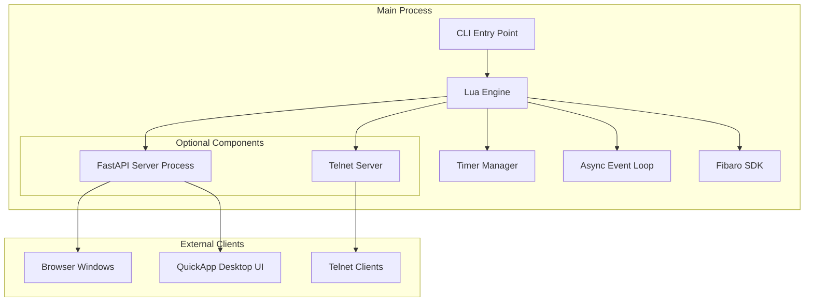

## Component Details

### 1. Lua Engine (`src/plua/engine.py`)

The core execution engine that runs Lua scripts with Python integration:

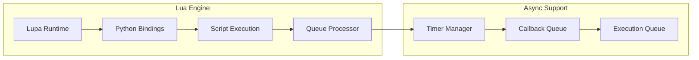

**Key Features:**
- Simplified single-threaded architecture with asyncio event loop
- Lupa-based Lua runtime with Python integration
- Async timer support with callback system
- Fast startup optimized for development workflows
- Graceful shutdown with user-friendly messages

### 2. FastAPI Web Server (`src/plua/fastapi_process.py`, `src/plua/web_server.py`)

FastAPI-based HTTP API with WebSocket support, optimized for fast startup:

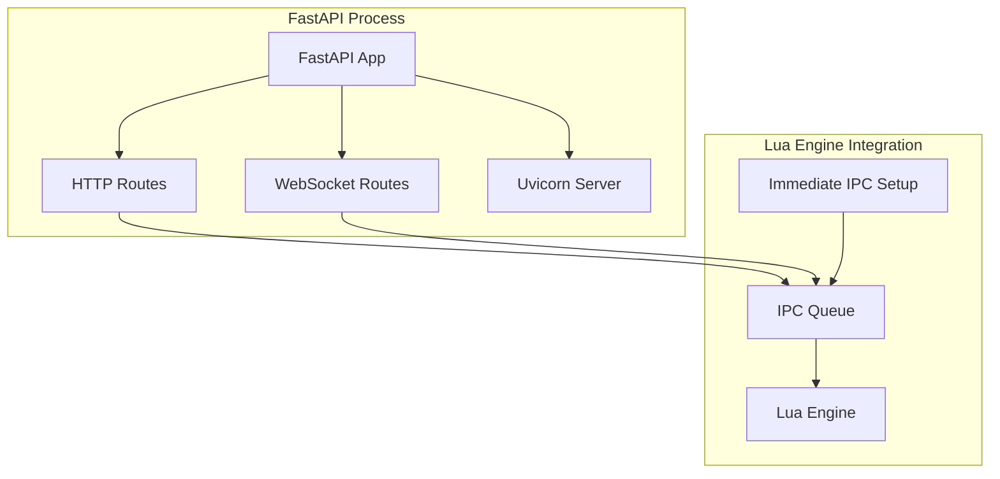

**Key Features:**
- Non-blocking FastAPI startup with immediate IPC setup
- WebSocket support for real-time QuickApp updates
- RESTful API for script execution and QuickApp management
- Optimized for development workflow with fast iteration cycles

### 3. QuickApp System (`src/plua/static/quickapp_ui.html`, `src/plua/fastapi_process.py`)

Browser-based Fibaro QuickApp emulation with real-time WebSocket updates:

```mermaid
graph TB
    subgraph "Browser UI"
        DESKTOP_UI[Desktop Windows]
        QUICKAPP_HTML[QuickApp UI HTML]
        WEBSOCKET_CLIENT[WebSocket Client]
        PING_PONG[Ping/Pong Health Check]
    end
    
    subgraph "FastAPI Server"
        QUICKAPP_ROUTES[QuickApp Routes]
        WEBSOCKET_SERVER[WebSocket Server]
        UI_BROADCAST[UI Update Broadcast]
        IPC_QUEUE[IPC Message Queue]
    end
    
    subgraph "Lua Engine"
        FIBARO_QA[QuickApp Instance]
        UPDATE_VIEW[updateView() calls]
        UI_CALLBACKS[UI Button Callbacks]
    end
    
    DESKTOP_UI --> QUICKAPP_HTML
    QUICKAPP_HTML --> WEBSOCKET_CLIENT
    WEBSOCKET_CLIENT <--> WEBSOCKET_SERVER
    WEBSOCKET_CLIENT --> PING_PONG
    WEBSOCKET_SERVER --> UI_BROADCAST
    UI_BROADCAST --> IPC_QUEUE
    IPC_QUEUE --> FIBARO_QA
    UPDATE_VIEW --> UI_BROADCAST
    UI_CALLBACKS --> FIBARO_QA
```

**Key Features:**
- Real-time UI updates via WebSocket
- Development-friendly connection management
- Automatic window reuse and cleanup
- Browser-based QuickApp UI rendering
- Ping/pong health check (5-second intervals)
- UI state preservation during reconnection
- Manual refresh capability for development workflow

**Connection Management:**
- **Simple Ping/Pong**: Clean 5-second ping with 8-second timeout
- **Auto-reconnection**: Conservative reconnection with 10-second delays
- **Status Preservation**: UI state maintained when server restarts
- **Focus Detection**: Automatic reconnection check on window focus
- **Manual Refresh**: Developer-controlled UI refresh button

### 4. CLI Interface (`src/plua/cli.py`)

Simplified command-line interface optimized for fast startup and development workflow:

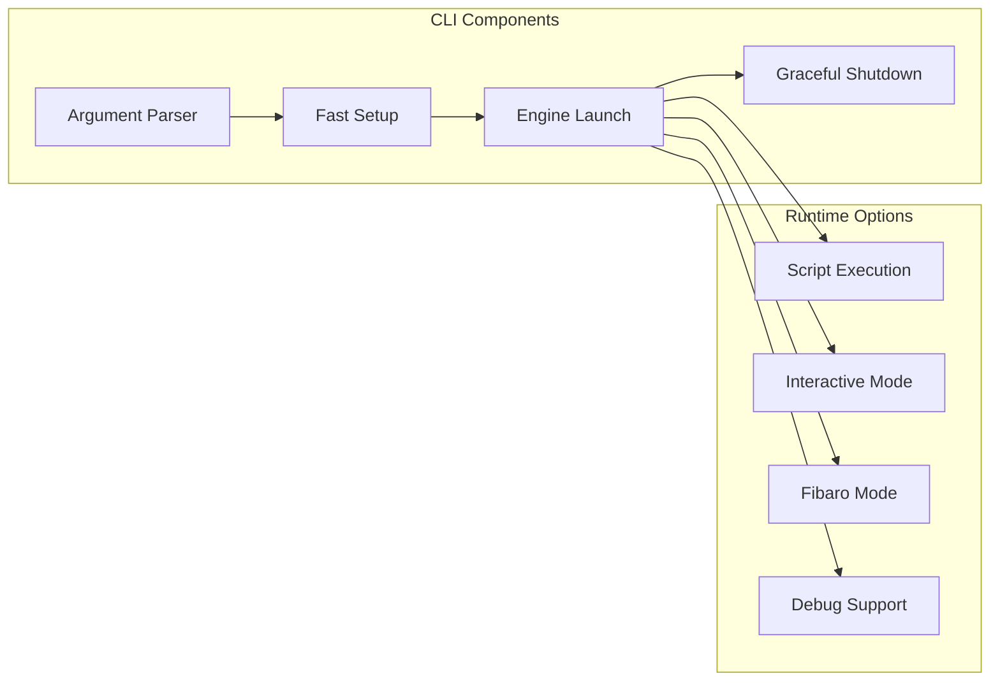

**Key Features:**
- Fast startup with immediate IPC setup (no blocking sleeps)
- Graceful shutdown with "👋 Goodbye!" message on Ctrl-C
- Support for script fragments via `-e` flag
- Integrated debugging support with VS Code
- Flexible run duration control with `--run-for` parameter

### 5. Telnet Server (`src/plua/lua_bindings.py`)

Optional async telnet server for interactive REPL access:

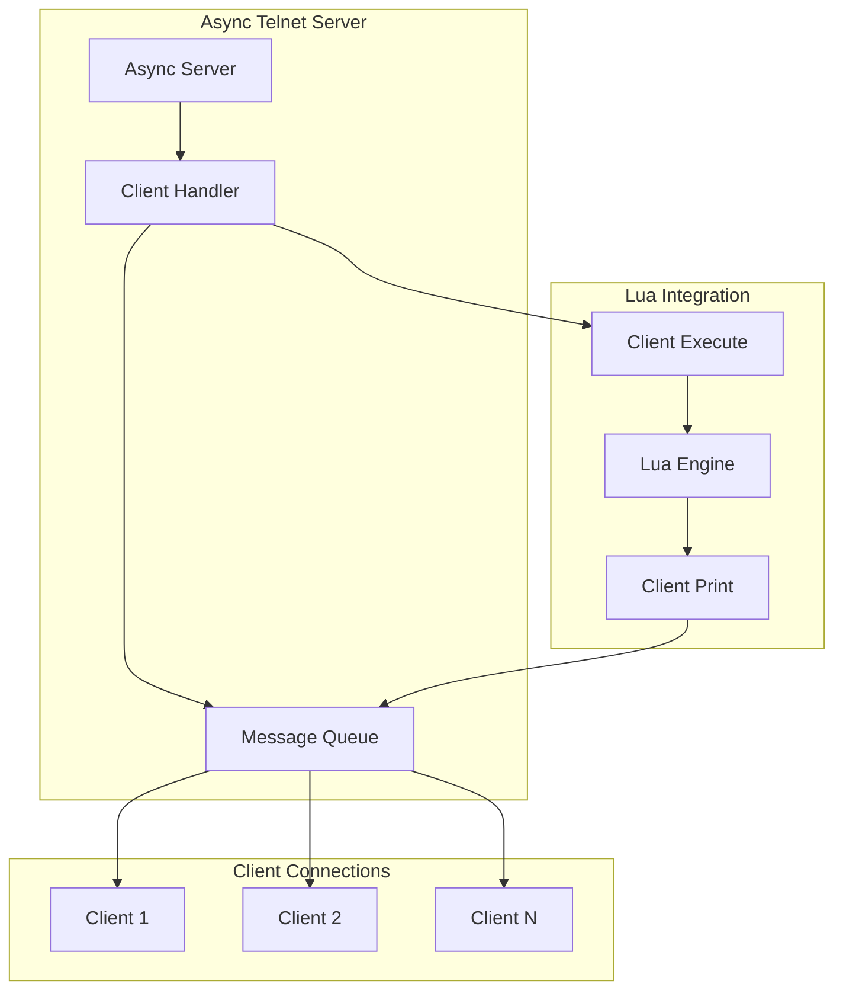

**Key Features:**
- Non-blocking async implementation  
- Multiple client support
- Integrated with Lua print system
- Optional component (enabled with `--telnet` flag)

## Execution Model

PLua uses a simplified single-threaded execution model with asyncio for better performance:

### Execution Responsibilities

1. **Main Thread**: All execution (Lua engine, FastAPI IPC, telnet server)
2. **FastAPI Process**: HTTP/WebSocket API handling (separate process when enabled)
3. **Browser Processes**: QuickApp UI windows (external browser windows)

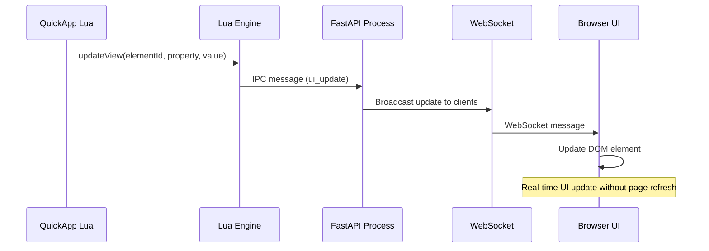

### 2. QuickApp Button Callback Flow

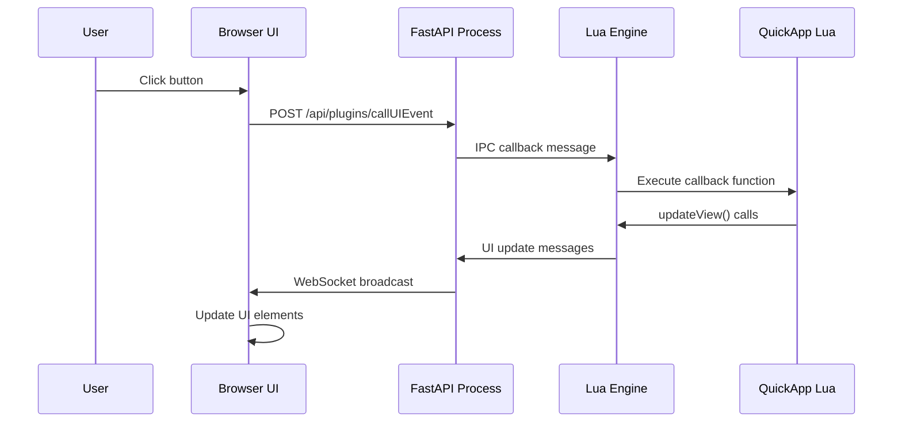

### 3. Connection Health Check Flow

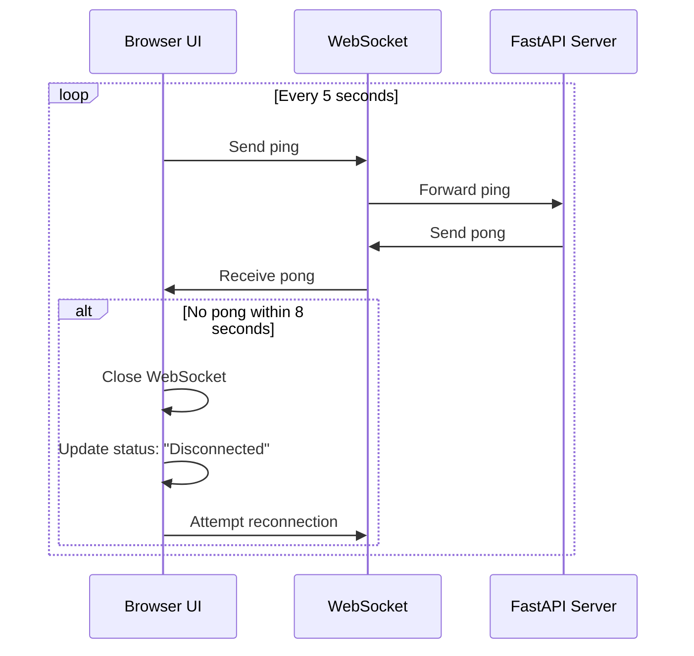

### 4. Script Execution Flow

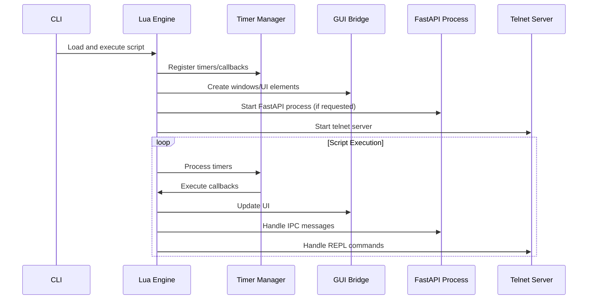

### 5. GUI Command Flow

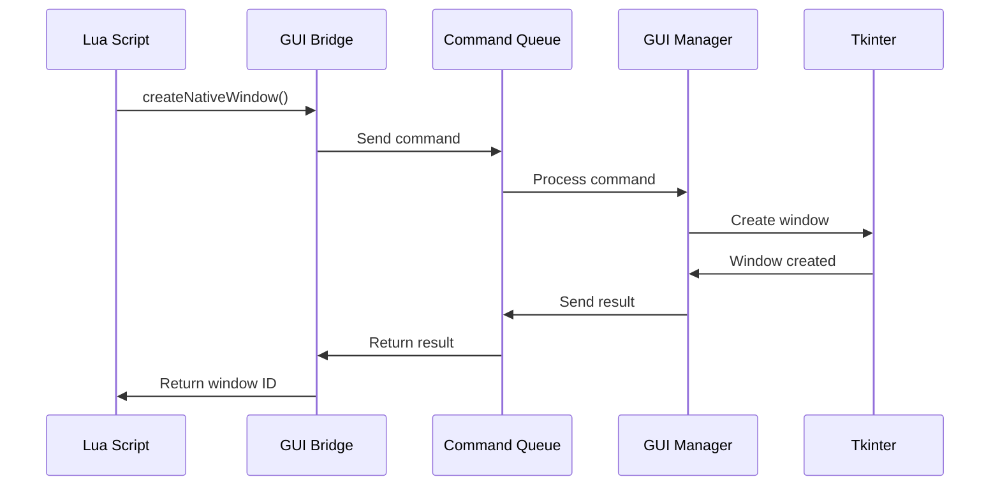

### 6. Web API Flow

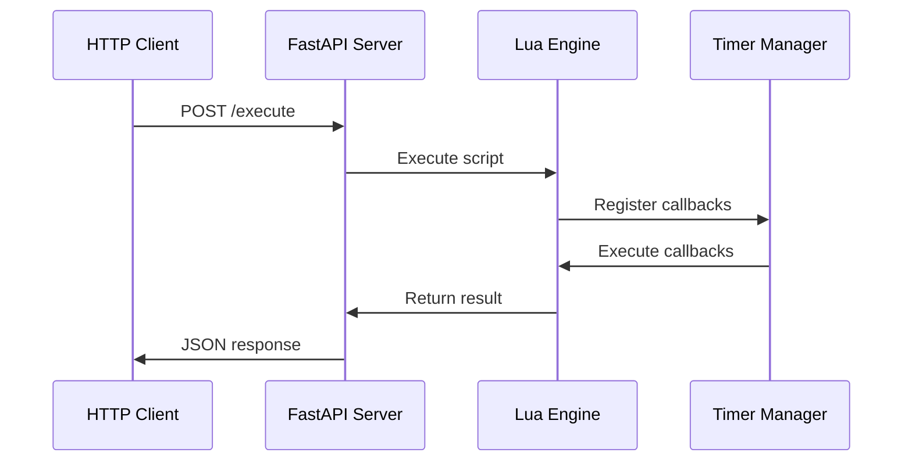

### 7. REPL Communication Flow

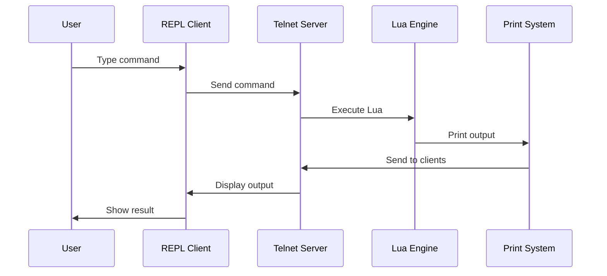

### Communication Patterns

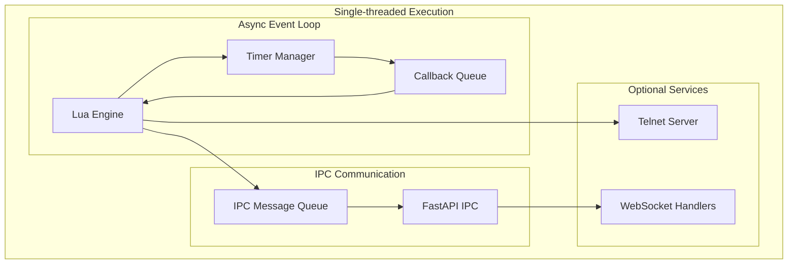

## Data Flow Diagrams

### 1. QuickApp UI Update Flow

## Usage Patterns

### 1. Basic Script Execution

## Usage Patterns

### 1. Basic Script Execution

```bash
./run.sh script.lua
# or with plua directly:
plua script.lua
```

**Flow:**
1. CLI starts engine with asyncio event loop
2. Engine loads and executes script
3. Script runs with async timer support
4. Process exits when script completes or timers finish

### 2. Interactive Development

```bash
./run.sh -i
# or:
plua -i
```

**Flow:**
1. CLI starts with interactive REPL on stdin/stdout
2. Uses prompt_toolkit for enhanced command-line experience
3. Commands executed immediately in Lua engine
4. Real-time feedback and graceful exit on Ctrl-C

### 3. Fibaro QuickApp Development

```bash
./run.sh --fibaro quickapp.lua
# or:
plua --fibaro quickapp.lua
```

**Flow:**
1. CLI starts with Fibaro SDK enabled
2. FastAPI process starts with QuickApp endpoints (when needed)
3. Lua script defines QuickApp with UI elements
4. Browser windows automatically open (if `--%%desktop:true`)
5. Real-time UI updates via WebSocket
6. Development cycle: edit script → restart → preserved UI state

### 4. Web API Server Mode

```lua
_PY.start_web_server("127.0.0.1", 8000)
```

**Flow:**
1. Lua starts web server in separate process
2. FastAPI provides HTTP endpoints with immediate IPC setup
3. External clients can execute Lua scripts
4. Results returned via JSON responses

### 5. Remote Development via Telnet

```bash
./run.sh --telnet
# Then connect with: telnet localhost 8023
```

**Flow:**
1. CLI starts telnet server on port 8023
2. Multiple clients can connect simultaneously
3. Each client gets isolated Lua execution context
4. Real-time command execution and output

**Development Features:**
- **UI State Preservation**: Browser windows keep last UI state during server restart
- **Manual Refresh**: Developer can manually refresh UI via button
- **Connection Health**: Clear status indicators and automatic reconnection
- **Background Updates**: UI updates work even when window is not focused
- **Multiple Windows**: Support for multiple QuickApp instances simultaneously

## Configuration and Extensions

### Configuration System

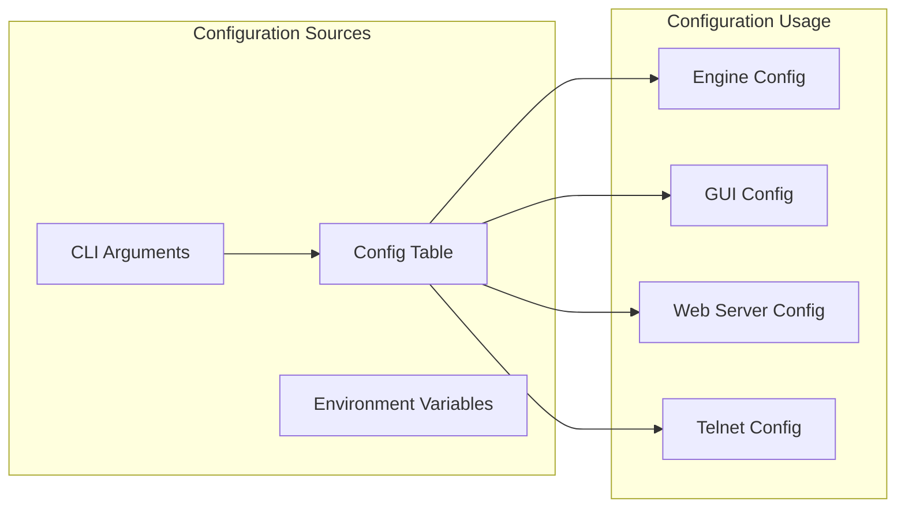

### Extension System

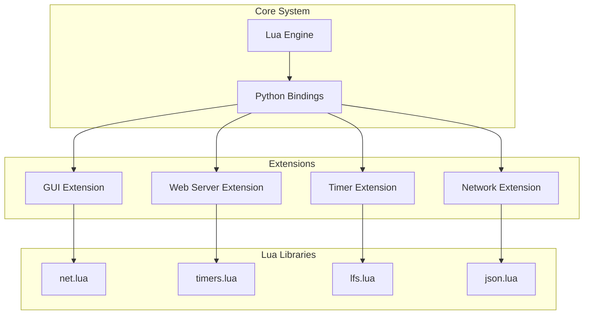

## Performance Considerations

### Startup Optimization

- **Fast CLI Startup**: Immediate IPC setup without blocking delays
- **Lazy Loading**: FastAPI process only started when needed
- **Single-threaded**: Eliminates thread synchronization overhead
- **Asyncio Integration**: Efficient event loop for timers and I/O

### Memory Management

- **Lua Engine**: Uses Lupa for efficient Python-Lua integration
- **Async Operations**: Non-blocking I/O prevents memory leaks
- **Process Isolation**: FastAPI in separate process for better resource management
- **Graceful Cleanup**: Proper resource cleanup on shutdown

### Scalability

- **Multiple Clients**: Telnet server supports multiple concurrent connections
- **Web API**: FastAPI provides high-performance HTTP handling
- **Timer System**: Efficient async timer management for many concurrent timers
- **WebSocket Updates**: Batched updates reduce network overhead

## Security Considerations

### Network Security

- **Telnet Server**: Binds to localhost only by default
- **Web Server**: Configurable host binding for network access
- **Client Validation**: Input validation for all external commands
- **Timeout Protection**: Script execution timeouts prevent hanging

### Script Security

- **Sandboxing**: Lua scripts run in controlled environment
- **Resource Limits**: Timer and callback limits prevent resource exhaustion
- **Error Handling**: Comprehensive error handling prevents crashes
- **Input Validation**: All external inputs are validated

## Recent Enhancements

### Performance Improvements

1. **✅ Fast Startup**: Removed blocking sleep during FastAPI startup for immediate IPC setup
2. **✅ Single-threaded Architecture**: Simplified from multi-threaded to single-threaded with asyncio
3. **✅ Graceful Shutdown**: Added friendly "👋 Goodbye!" message on Ctrl-C interruption
4. **✅ Optimized CLI**: Fast argument parsing and immediate engine launch
5. **✅ VS Code Integration**: Optimized debugging workflow with luaMobDebug support

### Developer Experience

1. **✅ WebSocket Support**: Real-time bidirectional communication for QuickApp UI
2. **✅ Fibaro QuickApp Emulation**: Complete QuickApp SDK with UI rendering
3. **✅ Browser-based UI**: Modern web-based UI with real-time updates
4. **✅ Development-friendly Workflow**: UI state preservation and manual refresh
5. **✅ Connection Health Management**: Robust ping/pong system with automatic reconnection
6. **✅ Interactive REPL**: Enhanced command-line interface with prompt_toolkit

### Connection Management Improvements

- **Simplified Health Checks**: Clean 5-second ping/pong system
- **Conservative Reconnection**: 10-second delays, fewer attempts  
- **Status Preservation**: UI state maintained during server restarts
- **Developer Controls**: Manual refresh button and clear status indicators
- **Fast Development Cycle**: Immediate startup and graceful shutdown for rapid iteration

## Future Enhancements

### Planned Features

1. **Plugin System**: Dynamic loading of Python extensions
2. **Enhanced REPL**: Tab completion and syntax highlighting improvements
3. **Performance Profiling**: Built-in performance monitoring tools
4. **Advanced Debugging**: Integrated debugger with breakpoints
5. **Mobile UI Support**: Touch-friendly QuickApp interfaces
6. **Process Reuse**: Keep FastAPI process running between script executions

### Architecture Evolution

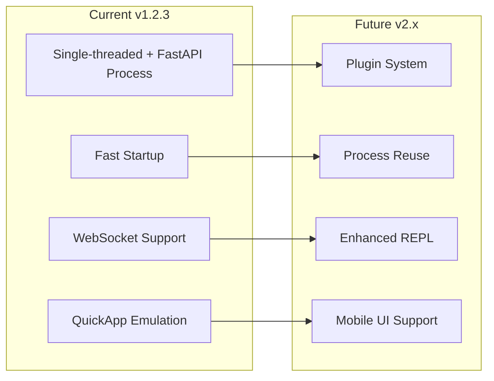

This architecture provides a solid foundation for building complex Lua applications with web-based UI, network capabilities, Fibaro QuickApp emulation, and high performance while maintaining simplicity and fast development cycles. The recent optimizations make PLua particularly well-suited for rapid development and debugging workflows in VS Code and other development environments. 