# PLua Architecture

EPLua is a Python-based Lua execution engine with native UI support, async timers, Fibaro QuickApp emulation, and multiple communication interfaces. This document describes the system architecture, threading model, and component interactions.

## System Overview

EPLua consists of several key components that work together to provide a rich Lua execution environment:

- **Lua Engine**: Core script execution with async timer support
- **GUI System**: Native tkinter-based UI with thread-safe bridge
- **QuickApp System**: Browser-based Fibaro QuickApp emulation with real-time updates
- **Web Server**: FastAPI-based HTTP API with WebSocket support for remote control
- **Telnet Server**: Async REPL interface for interactive debugging
- **REPL Client**: Enhanced command-line interface with history and completion

## Threading Architecture

EPLua uses a multi-threaded architecture to separate concerns and provide responsive UI:

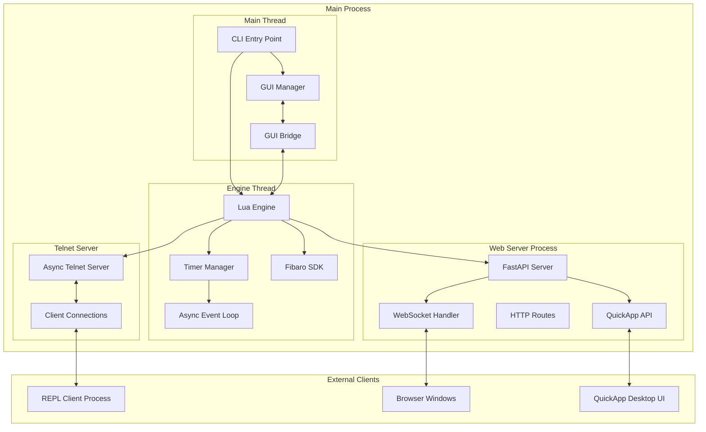

## Component Details

### 1. Lua Engine (`src/plua/engine.py`)

The core execution engine that runs Lua scripts with Python integration:

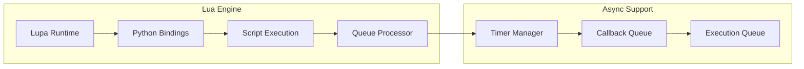

**Key Features:**
- Lupa-based Lua runtime with Python integration
- Async timer support with callback system
- Thread-safe script execution
- Queue-based communication between threads

### 2. GUI System (`src/plua/gui_bridge.py`, `src/plua/gui.py`)

Native tkinter-based UI with thread-safe communication:

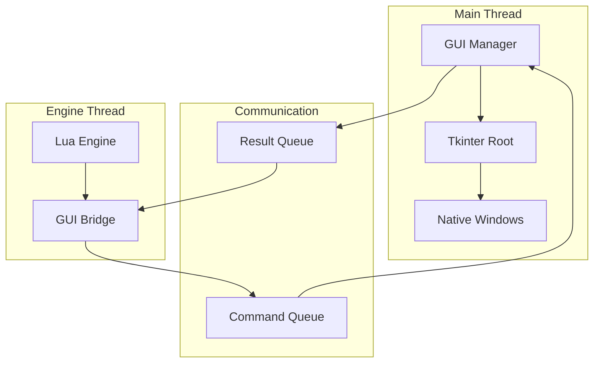

**Key Features:**
- Thread-safe bridge for GUI commands
- Native window creation and management
- Event-driven UI updates
- Queue-based command processing

### 3. QuickApp System (`src/plua/static/quickapp_ui.html`, `src/plua/fastapi_process.py`)

Browser-based Fibaro QuickApp emulation with real-time WebSocket updates:

```mermaid
graph TB
    subgraph "Browser UI"
        DESKTOP_UI[Desktop Windows]
        QUICKAPP_HTML[QuickApp UI HTML]
        WEBSOCKET_CLIENT[WebSocket Client]
        PING_PONG[Ping/Pong Health Check]
    end
    
    subgraph "FastAPI Server"
        QUICKAPP_ROUTES[QuickApp Routes]
        WEBSOCKET_SERVER[WebSocket Server]
        UI_BROADCAST[UI Update Broadcast]
        IPC_QUEUE[IPC Message Queue]
    end
    
    subgraph "Lua Engine"
        FIBARO_QA[QuickApp Instance]
        UPDATE_VIEW[updateView() calls]
        UI_CALLBACKS[UI Button Callbacks]
    end
    
    DESKTOP_UI --> QUICKAPP_HTML
    QUICKAPP_HTML --> WEBSOCKET_CLIENT
    WEBSOCKET_CLIENT <--> WEBSOCKET_SERVER
    WEBSOCKET_CLIENT --> PING_PONG
    WEBSOCKET_SERVER --> UI_BROADCAST
    UI_BROADCAST --> IPC_QUEUE
    IPC_QUEUE --> FIBARO_QA
    UPDATE_VIEW --> UI_BROADCAST
    UI_CALLBACKS --> FIBARO_QA
```

**Key Features:**
- Real-time UI updates via WebSocket
- Development-friendly connection management
- Automatic window reuse and cleanup
- Browser-based QuickApp UI rendering
- Ping/pong health check (5-second intervals)
- UI state preservation during reconnection
- Manual refresh capability for development workflow

**Connection Management:**
- **Simple Ping/Pong**: Clean 5-second ping with 8-second timeout
- **Auto-reconnection**: Conservative reconnection with 10-second delays
- **Status Preservation**: UI state maintained when server restarts
- **Focus Detection**: Automatic reconnection check on window focus
- **Manual Refresh**: Developer-controlled UI refresh button

### 4. Web Server (`src/plua/fastapi_process.py`, `src/plua/web_server.py`)

FastAPI-based HTTP API with WebSocket support for remote control and QuickApp emulation:

```mermaid
graph LR
    subgraph "FastAPI Process"
        FASTAPI[FastAPI App]
        HTTP_ROUTES[HTTP Routes]
        WEBSOCKET_ROUTES[WebSocket Routes]
        UVICORN[Uvicorn Server]
    end
    
    subgraph "API Endpoints"
        ROOT[/]
        STATUS[/status]
        EXECUTE[/execute]
        QUICKAPP[/plua/quickApp/*]
        WEBSOCKET[/ws WebSocket]
        UI_CALLBACK[/api/plugins/callUIEvent]
    end
    
    subgraph "Engine Integration"
        LUA_ENGINE[Lua Engine]
        IPC_QUEUE[IPC Queue]
        THREAD_EXEC[Thread Execution]
    end
    
    FASTAPI --> HTTP_ROUTES
    FASTAPI --> WEBSOCKET_ROUTES
    HTTP_ROUTES --> ROOT
    HTTP_ROUTES --> STATUS
    HTTP_ROUTES --> EXECUTE
    HTTP_ROUTES --> QUICKAPP
    HTTP_ROUTES --> UI_CALLBACK
    WEBSOCKET_ROUTES --> WEBSOCKET
    FASTAPI --> UVICORN
    EXECUTE --> THREAD_EXEC
    QUICKAPP --> IPC_QUEUE
    UI_CALLBACK --> IPC_QUEUE
    WEBSOCKET --> IPC_QUEUE
    THREAD_EXEC --> LUA_ENGINE
    IPC_QUEUE <--> LUA_ENGINE
```

**Key Features:**
- RESTful API for script execution
- Real-time engine status monitoring
- JSON-based function calling
- Thread-safe execution integration
- WebSocket support for real-time updates
- QuickApp API endpoints for Fibaro emulation
- IPC queue for cross-process communication

### 5. Telnet Server (`src/plua/lua_bindings.py`)

Async telnet server for interactive REPL access:

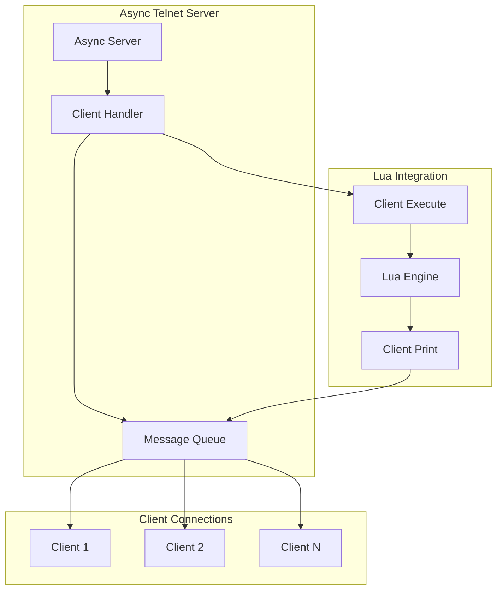

**Key Features:**
- Non-blocking async implementation
- Multiple client support
- Integrated with Lua print system
- Automatic stdout fallback

### 6. REPL Client (`src/plua/repl.py`)

Enhanced command-line interface with advanced features:

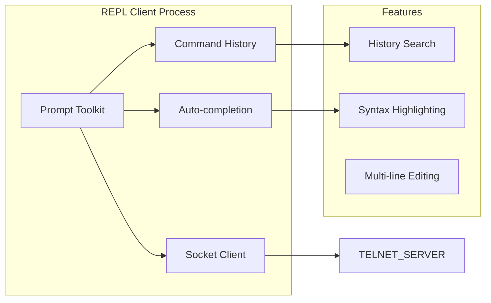

**Key Features:**
- Rich command-line interface with prompt_toolkit
- Command history and search
- Auto-completion for Lua functions
- Multi-line editing support

## Data Flow Diagrams

### 1. QuickApp UI Update Flow

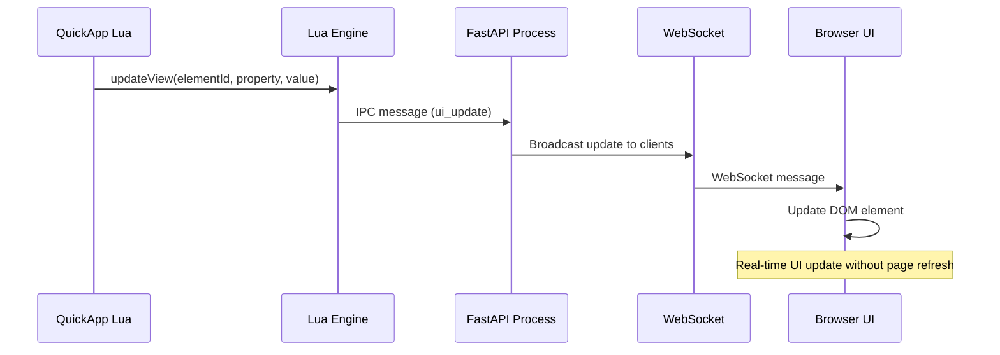

### 2. QuickApp Button Callback Flow

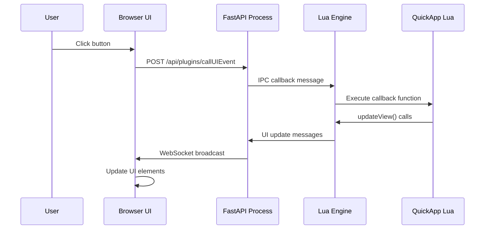

### 3. Connection Health Check Flow

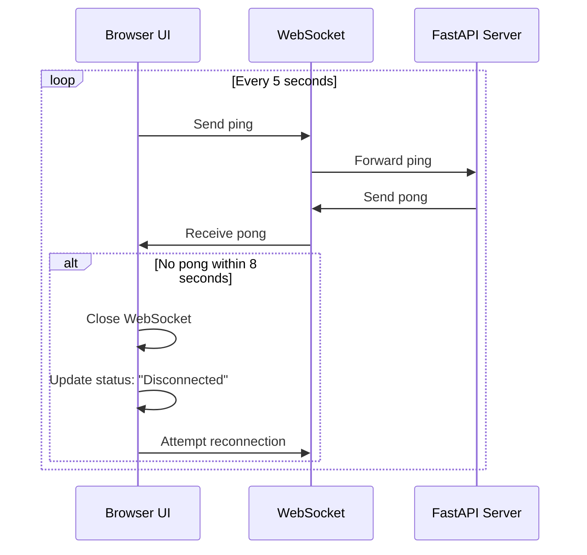

### 4. Script Execution Flow

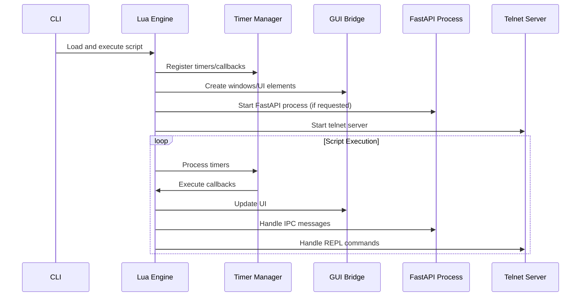

### 5. GUI Command Flow

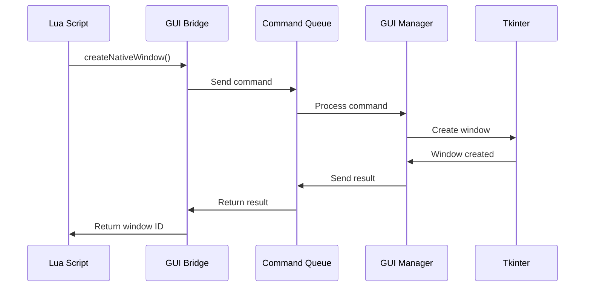

### 6. Web API Flow

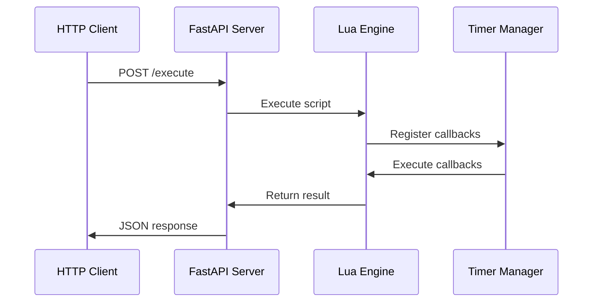

### 7. REPL Communication Flow

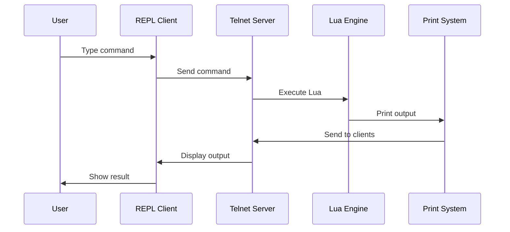

## Threading Model

### Thread Responsibilities

1. **Main Thread**: GUI management and user interaction
2. **Engine Thread**: Lua script execution and async operations
3. **FastAPI Process**: HTTP/WebSocket API handling (separate process)
4. **Telnet Server**: Async REPL server (runs in engine thread)
5. **REPL Client Process**: Separate process for enhanced CLI
6. **Browser Processes**: QuickApp UI windows (external browser windows)

### Thread Communication

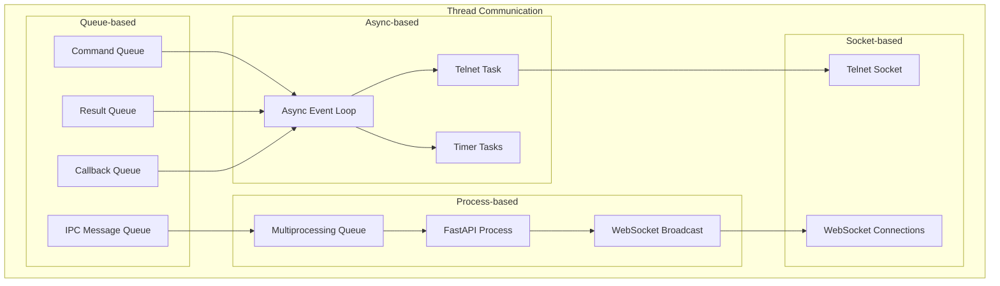

## Usage Patterns

### 1. Basic Script Execution

```bash
./run.sh script.lua
```

**Flow:**
1. CLI starts engine thread
2. Engine loads and executes script
3. Script runs with async timer support
4. Process exits when script completes

### 2. GUI Application

```bash
./run.sh gui_app.lua
```

**Flow:**
1. CLI starts GUI in main thread
2. Engine runs in worker thread
3. GUI bridge enables thread-safe communication
4. Lua creates native windows and UI elements

### 3. Web API Server

```lua
_PY.start_web_server("127.0.0.1", 8000)
```

**Flow:**
1. Lua starts web server in separate thread
2. FastAPI provides HTTP endpoints
3. External clients can execute Lua scripts
4. Results returned via JSON responses

### 4. Interactive REPL

```bash
./run.sh --interactive
```

**Flow:**
1. CLI starts telnet server
2. REPL client connects to telnet server
3. User types commands interactively
4. Results displayed in real-time

### 5. Fibaro QuickApp Development

```bash
./run.sh --fibaro quickapp.lua
```

**Flow:**
1. CLI starts with Fibaro SDK enabled
2. FastAPI process starts with QuickApp endpoints
3. Lua script defines QuickApp with UI elements
4. Browser windows automatically open (if `--%%desktop:true`)
5. Real-time UI updates via WebSocket
6. Development cycle: edit script → restart → preserved UI state

**Development Features:**
- **UI State Preservation**: Browser windows keep last UI state during server restart
- **Manual Refresh**: Developer can manually refresh UI via button
- **Connection Health**: Clear status indicators and automatic reconnection
- **Background Updates**: UI updates work even when window is not focused
- **Multiple Windows**: Support for multiple QuickApp instances simultaneously

## Configuration and Extensions

### Configuration System

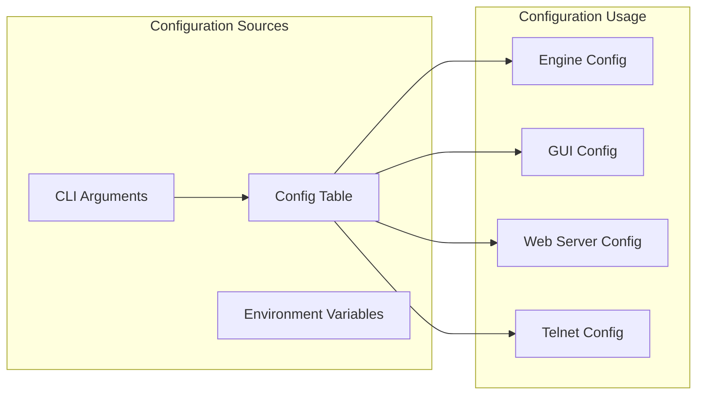

### Extension System

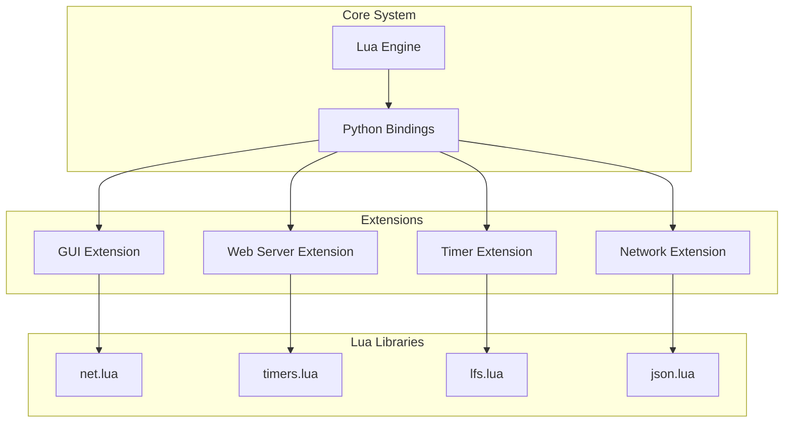

## Performance Considerations

### Memory Management

- **Lua Engine**: Uses Lupa for efficient Python-Lua integration
- **GUI Bridge**: Queue-based communication minimizes memory overhead
- **Async Operations**: Non-blocking I/O prevents memory leaks
- **Thread Safety**: Proper synchronization prevents race conditions

### Scalability

- **Multiple Clients**: Telnet server supports multiple concurrent connections
- **Web API**: FastAPI provides high-performance HTTP handling
- **Timer System**: Efficient async timer management for many concurrent timers
- **GUI Updates**: Batched updates reduce UI thread overhead

## Security Considerations

### Network Security

- **Telnet Server**: Binds to localhost only by default
- **Web Server**: Configurable host binding for network access
- **Client Validation**: Input validation for all external commands
- **Timeout Protection**: Script execution timeouts prevent hanging

### Script Security

- **Sandboxing**: Lua scripts run in controlled environment
- **Resource Limits**: Timer and callback limits prevent resource exhaustion
- **Error Handling**: Comprehensive error handling prevents crashes
- **Input Validation**: All external inputs are validated

## Recent Enhancements

### Implemented Features

1. **✅ WebSocket Support**: Real-time bidirectional communication for QuickApp UI
2. **✅ Fibaro QuickApp Emulation**: Complete QuickApp SDK with UI rendering
3. **✅ Browser-based UI**: Modern web-based UI with real-time updates
4. **✅ Development-friendly Workflow**: UI state preservation and manual refresh
5. **✅ Connection Health Management**: Robust ping/pong system with automatic reconnection
6. **✅ Multi-process Architecture**: Separate FastAPI process for better isolation

### Connection Management Improvements

- **Simplified Health Checks**: Clean 5-second ping/pong system
- **Conservative Reconnection**: 10-second delays, fewer attempts
- **Status Preservation**: UI state maintained during server restarts
- **Developer Controls**: Manual refresh button and clear status indicators

## Future Enhancements

### Planned Features

1. **Plugin System**: Dynamic loading of Python extensions
2. **Distributed Mode**: Multi-node EPLua clusters  
3. **Performance Profiling**: Built-in performance monitoring
4. **Advanced Debugging**: Integrated debugger with breakpoints
5. **Mobile UI Support**: Touch-friendly QuickApp interfaces

### Architecture Evolution

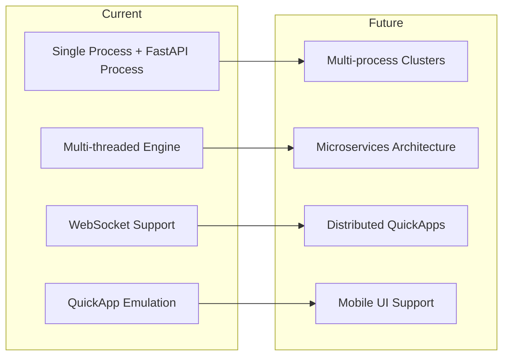

This architecture provides a solid foundation for building complex Lua applications with rich UI, network capabilities, Fibaro QuickApp emulation, and high performance while maintaining simplicity and extensibility. The recent addition of the QuickApp system makes EPLua particularly well-suited for Fibaro home automation development with a modern, web-based development workflow. 