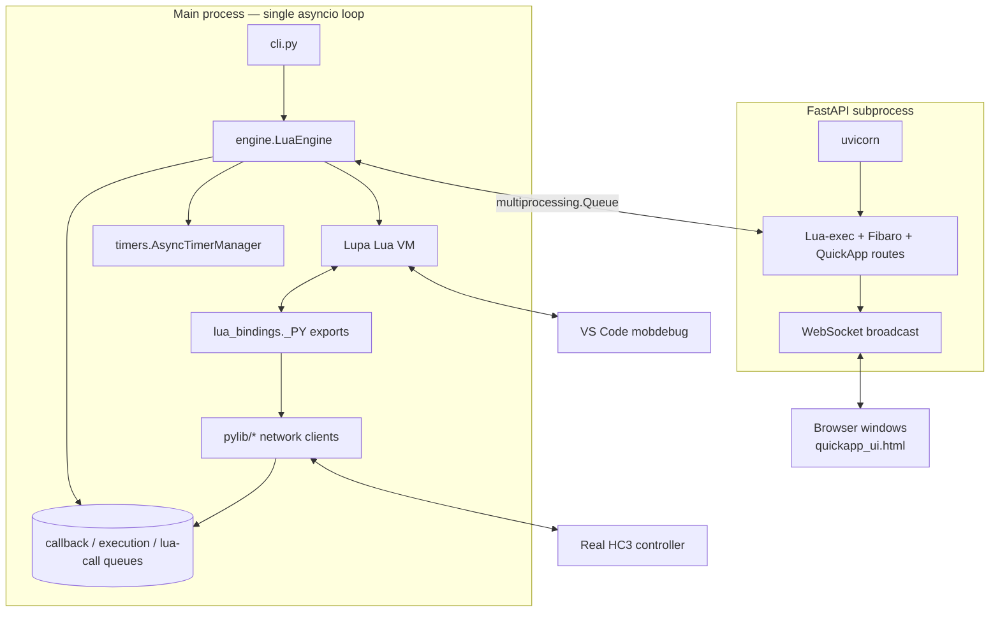

# PLua Architecture

PLua is a Lua 5.4 runtime hosted in Python. It uses [Lupa](https://github.com/scoder/lupa)
for the Lua VM, an asyncio loop for timers and network I/O, and ships a
substantial Lua codebase that emulates a Fibaro Home Center 3 (HC3) controller —
enough to run real Fibaro QuickApps locally for development.

This document describes the runtime layers, where Python ends and Lua begins,
and how data flows between them. It targets new contributors who want to find
their way around the source tree.

## Scope and non-goals

- **In scope:** running Lua scripts; running Fibaro QuickApps locally
  (online, offline, or proxied to a real HC3); browser-based QuickApp UI;
  REST API for execution and Fibaro endpoints; debugger integration.
- **Out of scope:** packaging Lua as a standalone binary; multi-tenant
  hosting; production HC3 replacement.

## Process and runtime model

PLua runs in **two OS-level processes**:

| Process | Owns | Concurrency |
|---|---|---|
| **Main** | The Lua VM (Lupa), the asyncio loop, all `pylib` network clients, the callback registry | One asyncio event loop; Lua executes synchronously inside coroutines on that loop |
| **FastAPI subprocess** | Uvicorn + the HTTP/WebSocket API | Its own asyncio loop |

The two processes communicate over `multiprocessing.Queue` (Unix) or
`queue.Queue` with a worker thread (Windows — `multiprocessing` spawn is
unreliable there). Each in-flight HTTP request from FastAPI carries a UUID
`request_id`; the main process executes the Lua and posts the result back
on the response queue.

Background threads inside the main process (e.g. the synchronous TCP
sockets used by `mobdebug`, or any pylib client that needs a thread) post
results back to the loop via `LuaEngine.post_callback_from_thread()`,
which drops them on a thread-safe `asyncio.Queue` consumed by the engine's
queue processor.


```mermaid
graph TB
    subgraph Main["Main process — single asyncio loop"]
        CLI[cli.py]
        ENGINE[engine.LuaEngine]
        LUPA[Lupa Lua VM]
        TIMERS[timers.AsyncTimerManager]
        BINDINGS[lua_bindings._PY exports]
        PYLIB[pylib/* network clients]
        QUEUES[(callback / execution / lua-call queues)]
    end

    subgraph FastAPI["FastAPI subprocess"]
        UVICORN[uvicorn]
        ROUTES[Lua-exec + Fibaro + QuickApp routes]
        WS[WebSocket broadcast]
    end

    Browser[Browser windows<br/>quickapp_ui.html]
    HC3[Real HC3 controller]
    Debugger[VS Code mobdebug]

    CLI --> ENGINE
    ENGINE --> LUPA
    ENGINE --> TIMERS
    ENGINE --> QUEUES
    LUPA <--> BINDINGS
    BINDINGS --> PYLIB
    PYLIB --> QUEUES

    ENGINE <-- "multiprocessing.Queue" --> ROUTES
    UVICORN --> ROUTES
    ROUTES --> WS
    WS <--> Browser
    PYLIB <--> HC3
    LUPA <--> Debugger
```

## Source layout

```
src/
├── plua/        Python core (engine, CLI, FastAPI, bridge to Lua)
├── pylib/       Python network/filesystem primitives exposed to Lua
└── lua/         Lua runtime; src/lua/fibaro/* is the HC3 emulator
```

Roughly 6 kLOC of Python and 12 kLOC of Lua (mobdebug and the generated
Fibaro API account for ~6 kLOC of that).

## Python core (`src/plua/`)

| Module | Role |
|---|---|
| `cli.py` | Argument parsing, environment detection, port cleanup, engine bootstrap |
| `engine.py` | `LuaEngine`: owns the Lupa VM, the queue processor, and the cross-thread queue |
| `timers.py` | `AsyncTimerManager`: `setTimeout`-style timers backed by asyncio tasks |
| `lua_bindings.py` | The `@export_to_lua` decorator, the `_PY` namespace, table converters; bundles ~50 utility functions exposed to Lua |
| `extensions.py` | `_PY.loadPythonModule()` — dynamic discovery and loading of `pylib/*` modules |
| `fastapi_process.py` | Builds the FastAPI app, manages the subprocess (or thread on Windows), runs the IPC pump |
| `fibaro_api_endpoints.py` | **Generated.** Typed FastAPI route stubs for the full HC3 REST surface; each route delegates to Lua via `fibaroApiHook()` |
| `fibaro_api_models.py` | **Generated.** Pydantic models for HC3 request/response shapes |
| `generate_typed_fibaro_api.py` | The generator. Run by hand against Fibaro's Swagger JSON when the API changes; not used at runtime |
| `sync_socket.py` | Blocking TCP socket pool — needed by `mobdebug`, which assumes synchronous LuaSocket semantics |
| `window_manager.py` | Opens/reuses browser windows for QuickApp UIs; persists state to `~/.plua/windows.json` |
| `console.py` | Rich console with environment-aware color/terminal handling |
| `scaffolding.py` | `--init-qa` project scaffolding (writes `.vscode/`, `.project`, starter Lua) |
| `path_utils.py` | Locate static assets in both source and Nuitka-built layouts |

### The callback registry

Asynchronous results — timer fires, HTTP responses, MQTT messages, thread
results — funnel through three asyncio queues consumed by
`LuaEngine._process_queues()`:

- **`_callback_queue`** — `(callback_id, error, result)` from any
  background source. `callback_id` is an **integer** registered by
  `_PY.registerCallback()` in `init.lua`.
- **`_execution_queue`** — Lua execution requests from FastAPI; keyed by
  UUID `request_id`.
- **`_lua_call_queue`** — direct Python→Lua calls posted from threads.

The registry has no separate data structure; entries live in their queue
until the processor delivers them via `_PY.timerExpired(id, err, result)`.

### Lua ↔ Python bridge

- `@export_to_lua(name=None)` registers a Python callable. At engine
  startup `LuaBindings._setup_exported_functions()` iterates the registry
  and assigns each function into a single Lua table called `_PY`.
- `python_to_lua_table(data)` recurses through dicts/lists and uses
  `LuaRuntime.table_from(...)` to produce Lupa tables.
- `lua_to_python_table(t)` walks a Lua table, converts keys/values, and
  detects array-shaped tables (consecutive 1-indexed integer keys) so they
  become Python lists rather than dicts.
- A `locale.setlocale(LC_CTYPE, 'C')` call before `LuaRuntime` creation
  forces Lua's `%S`/`%s` patterns (which use libc `isspace()`) onto the C
  locale, so multi-byte UTF-8 characters such as `ą` are not split.

## Network layer (`src/pylib/`)

`pylib` is a thin library of network primitives. Each module exposes a
flat set of `@export_to_lua` functions; the corresponding Lua wrappers
live in `src/lua/net.lua` and `src/lua/socket.lua`.

| Module | Lua-visible primitive |
|---|---|
| `http_client.py` | `call_http`, `http_request_sync`, plus an HTTP server |
| `tcp_client.py` | TCP client + server (asyncio streams) |
| `udp_client.py` | UDP socket via asyncio DatagramProtocol |
| `websocket_client.py` | WebSocket client + server (aiohttp) |
| `mqtt_client.py` | MQTT client (aiomqtt) with per-event listeners |
| `filesystem.py` | LuaFileSystem (`lfs`) compatibility — synchronous |

The shape of every async client is the same: Lua passes a `callback_id`
(integer); Python schedules an `asyncio.create_task`; on completion it
calls `engine.post_callback_from_thread(callback_id, result)`. The Lua
side dispatches that to the registered callback via the queue processor.

`pylib` only depends on `plua.lua_bindings` (for the decorator and the
engine accessor). It must not import anything else from `plua/`.

## Lua runtime (`src/lua/`)

| File | Role |
|---|---|
| `init.lua` | Boot script — UTF-8 patches, callback registry, timer wrappers, dispatcher to user code |
| `class.lua` | Minimal metatable-based OOP (`class 'Name'`) used by `Emulator`, `QuickApp`, etc. |
| `json.lua` | Wraps `_PY.to_json` / `_PY.parse_json`; adds `json.encodeLua`, `json.initArray` |
| `timers.lua` | Re-exports `setTimeout`/`setInterval` as globals |
| `net.lua` | `net.HTTPClient`, `net.TCPSocket`, `net.UDPSocket`, `net.WebSocketClient`, `net.MQTTClient` |
| `socket.lua` | LuaSocket-compatible synchronous sockets (used by `mobdebug`) |
| `lfs.lua` | LuaFileSystem façade over `pylib.filesystem` |
| `mobdebug.lua` | Vendored remote debugger (Paul Kulchenko); loaded only when a debugger is attached |
| `diagnostic.lua` | `--diagnostic` self-check (config dump, HC3 reachability) |
| `fibaro.lua` | Bootstrap stub — instantiates the `Emu` emulator and rebinds `_PY.mainLuaFile()` |

### Boot sequence

1. Python builds the engine, exposes `_PY`, and runs `init.lua`.
2. `init.lua` patches I/O for UTF-8, sets up the callback table, and
   exports timer helpers. It defines `_PY.mainLuaFile(filenames)` as the
   default dispatcher (load and run the Lua files directly).
3. If `--fibaro` was given, `fibaro.lua` runs next: it requires
   `fibaro.emulator`, instantiates the `Emu` singleton, and **overrides**
   `_PY.mainLuaFile()` to call `Emu:loadMainFile()` instead.
4. The CLI invokes `_PY.mainLuaFile(scripts)`. In Fibaro mode this parses
   `--%%` headers, builds a synthetic device, registers it in `Emu.DIR`,
   and instantiates the user's `QuickApp` class (calling `onInit` if
   defined).
5. The asyncio loop keeps running while there are active timers,
   intervals, or pending callbacks (subject to `--run-for`).

## Fibaro emulation (`src/lua/fibaro/`)

This subtree is the bulk of plua. Everything here is pure Lua — there is
no Python module that owns Fibaro state.

| File | Role |
|---|---|
| `emulator.lua` | The `Emu` god-object: device registry, API router, HC3 client, QA loader, UI compiler |
| `quickapp.lua` | `QuickAppBase` and `QuickApp` classes — the lifecycle and device-interaction API users see |
| `ui.lua` | Compiles `--%%u:` header rows into HC3 `viewLayout` / `uiView` JSON |
| `embedui.lua` | Default UIs auto-generated for common device types |
| `fibaro_api.lua` | Local REST router used by `Emu:API_CALL()` (handles `/devices`, `/globalVariables`, `/scenes`, …) |
| `fibaro_funs.lua` | The `__fibaro_*` and `fibaro.*` compatibility functions |
| `proxy.lua` | Proxy mode — installs a stub QA on a real HC3 and tunnels via WebSocket |
| `offline.lua` + `offline_data.lua` | Offline mode — registers handlers backed by an in-memory store |
| `helper.lua` | The `PluaHelper.fqa` device that runs on HC3 to forward restricted API calls |
| `tools.lua` | Implementation of `--tool uploadQA / downloadQA / updateFile / updateQA / backup` |
| `log.lua`, `utils.lua` | Logging (ANSI + HTML→ANSI), table/string helpers |
| `lib/qwikchild.lua` | Child-device library (UID-based, declarative) |
| `lib/eventlib.lua`, `lib/eventmgr.lua`, `lib/sourcetrigger.lua` | Event pattern matching and `refreshStates` dispatch |
| `lib/sha2.lua`, `lib/aeslua53.lua`, `lib/markdown.lua` | Vendored third-party libraries |
| `lib/rpc.lua`, `lib/betterqa.lua`, `lib/selectable.lua` | Optional QA enhancement libraries |
| `tools/backup.lua`, `tools/list.lua` | CLI tool implementations |

### The Emu object

`Emu` is a singleton `Emulator` instance created in `fibaro.lua`. It
holds:

- `Emu.DIR[deviceID]` → `{device, files, env, UI, UImap, headers, watches}`
- `Emu.api` → local router (GET/POST/PUT/DELETE)
- `Emu.api.hc3` → real-HC3 HTTP client, with wake-on-LAN retry
- `Emu.lib.*` → utilities (UI, logging, file I/O, mobdebug, FQA packing, window manager)
- `Emu.EVENT` → event listener registry

User QuickApp code reaches `Emu` via the `fibaro.plua` global.

### Modes

- **Online** (default) — `Emu.api.hc3` calls a real HC3 over HTTP, using
  credentials from `.env` / `~/.env`. Local routes intercept what they
  can; everything else is forwarded.
- **Offline** (`--%%offline:true`) — `fibaro/offline.lua` registers
  routes against an in-memory store seeded by `offline_data.lua`. No
  network calls.
- **Proxy** (`--%%proxy:true`) — the QA runs locally **and** a stub QA is
  installed on the real HC3. UI clicks and `refreshStates` events tunnel
  back to plua via WebSocket. Useful for testing on the real device
  without re-uploading on every change.

### UI round-trip

```mermaid
sequenceDiagram
    participant Browser
    participant FastAPI as FastAPI subprocess
    participant Engine as LuaEngine (main)
    participant QA as user QuickApp

    Browser->>FastAPI: POST /api/plugins/callUIEvent
    FastAPI->>Engine: enqueue request (request_id, body)
    Engine->>QA: env.quickApp:callAction(name, args)
    QA->>QA: handler runs; calls self:updateView()
    QA->>Engine: Emu:updateView() updates UImap + property
    Engine->>FastAPI: broadcast on WebSocket queue
    FastAPI->>Browser: WS message → DOM update
    Engine->>FastAPI: response on request_id
    FastAPI-->>Browser: 200 OK
```

The browser UI itself is `src/plua/static/quickapp_ui.html`. When a QA
declares `--%%desktop:true`, `Emu:registerQAGlobally()` calls
`_PY.open_quickapp_window()` (`window_manager.py`) to open the page.

## Lifetime and shutdown

PLua's exit semantics are controlled by `--run-for=N`:

| `N` | Behaviour |
|---|---|
| `0` | Run forever (until killed) |
| `> 0` | Run for **at least** N seconds, then exit when no timers/callbacks remain |
| `< 0` | Run for **exactly** `abs(N)` seconds, regardless of pending work |

The CLI polls `LuaEngine.has_active_operations()` (active intervals +
pending callbacks + active timers) once the floor is reached.

`Ctrl-C` triggers a graceful shutdown that drains queues and prints a
goodbye line. The FastAPI subprocess is terminated via its `Process` /
`Thread` handle.

## Distribution and dev workflow

- **Install:** `pip install plua` (Python 3.11+). PyPI is the only
  supported distribution channel; standalone binary builds exist as
  manual GitHub Actions but are not released.
- **Run:** `plua [script.lua] [options]` or, in this repo, `./run.sh`
  (which activates `.venv/`).
- **HC3 credentials:** `.env` in the project root or `~/.env`
  (`HC3_URL`, `HC3_USER`, `HC3_PASSWORD`).
- **VS Code:** `--init-qa` writes a `.vscode/launch.json` and `tasks.json`
  that invoke `mobdebug` for breakpoint debugging. The repository ships
  tasks for `uploadQA`, `updateQA`, `updateFile`, and `downloadQA`.
- **Virtual filesystem:** the companion `hc3-vfs` VS Code extension
  exposes a `hc3://` filesystem so QA files on a live HC3 can be edited
  in place.
- **Quality gate:** `scripts/create-release.sh` runs `ruff`, `pyright`,
  and `pytest` before tagging. `SKIP_CHECKS=1` bypasses for emergencies.

## Known limitations

- **`emulator.lua` is a god class** (~1100 lines): device registry, API
  routing, UI compilation, FQA tooling, HC3 connectivity all live in one
  file.
- **`lua_bindings.py` mixes ~50 unrelated exports** (timers, REPL, file
  I/O, platform info, telnet) inside a single setup method.
- **`fibaro_api_endpoints.py` and `fibaro_api_models.py` are generated**
  from a vendored Swagger snapshot. They will drift from a real HC3 over
  time and must be regenerated with `generate_typed_fibaro_api.py`.
- **Two callback-delivery paths in `pylib`**: HTTP and TCP call
  `_PY.timerExpired` directly; UDP, WebSocket, MQTT use
  `post_callback_from_thread`. Either is correct, but they are not
  uniform.
- **Per-protocol global registries are unlocked** — fine today (Lua is
  single-threaded inside the loop) but means concurrent connection
  creation from multiple threads would race.
- **`filesystem.py` is synchronous** — long file operations block the
  asyncio loop.
- **Proxy mode is sparsely tested.** It depends on a custom helper QA
  (`PluaHelper.fqa`) running on HC3.
